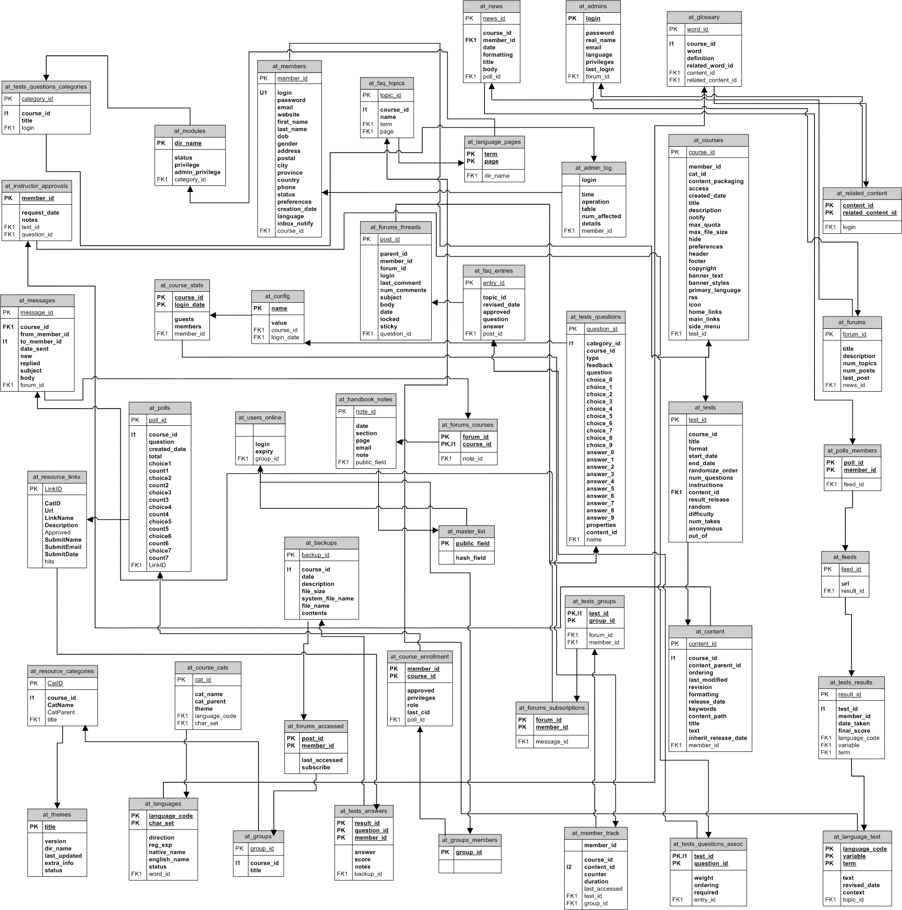
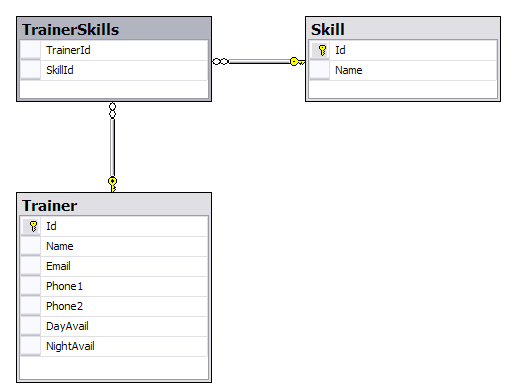
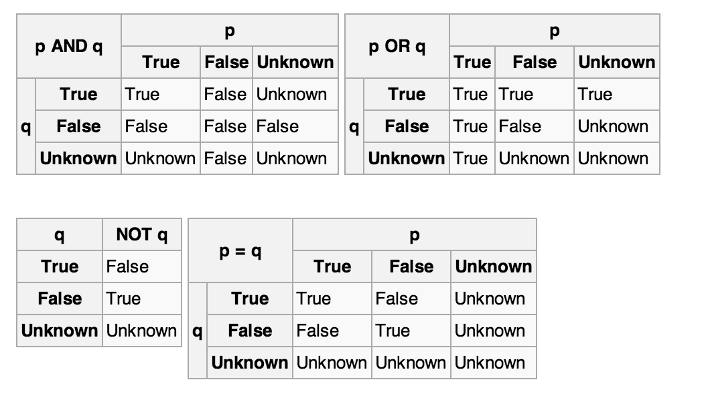

.. raw:: html

   

.. rubric:: System Development with Python
   :name: system-development-with-python

.. rubric:: Week 4, Databases
   :name: week-4-databases

April 28, 2015

Joseph Sheedy

*joseph.sheedy@gmail.com*

Git repository:
https://github.com/UWPCE-PythonCert/SystemDevelopment2015

.. raw:: html

   

.. raw:: html

   

.. rubric:: Today's topics
   :name: todays-topics

-  Relational databases and basic SQL
-  Python's DB API
-  Working with a database
-  Non-relational databases (NoSQL)

.. raw:: html

   

.. raw:: html

   

.. rubric:: Why a DB?
   :name: why-a-db

-  Need to persist the data your application uses
-  May need to store more data than you can hold in memory
-  May need to have multiple apps (or multiple instances) accessing the
   same data
-  May need to scale - have the DB running on a separate server(s)
-  May need to access data from systems written in different languages.

.. raw:: html

   

.. raw:: html

   

.. rubric:: Relational Databases
   :name: relational-databases

.. rubric:: A quick overview of SQL: History, Concepts, and Syntax
   :name: a-quick-overview-of-sql-history-concepts-and-syntax

.. raw:: html

   

.. raw:: html

   

.. rubric:: SQL - Structured Query Language
   :name: sql---structured-query-language

-  First invented in the early 1970s at IBM
-  Based on set theory, Relational Algebra, and Tuple Relational
   Calculus
-  Used to get at data stored in their System-R database management
   system
-  Picked up by Relational Software (now Oracle) in the late 1970s
-  Oracle V2, the first commercial Relational Database released in 1979
-  IBM followed with System/38, SQL/DS and DB2 between 1979 and 1983
-  SQL is standardized by ANSI, with varying degrees of compliance among
   vendors

http://en.wikipedia.org/wiki/SQL

.. raw:: html

   

.. raw:: html

   

.. rubric:: What is SQL
   :name: what-is-sql

-  SQL and Relational Database Management Systems (RDBMS) have been the
   de-facto standard for data persistence for 30+ years
-  Currently, there are more than 100 RDBMS available, both proprietary
   and open-source.
-  Most, if not all, include some implementation of SQL as their query
   language.

.. raw:: html

   

.. raw:: html

   

.. rubric:: RDMSs You're Likely to Encounter
   :name: rdmss-youre-likely-to-encounter

.. rubric:: Proprietary
   :name: proprietary

-  MS SQL Server
-  Oracle
-  MySQL Enterprise (Oracle)

.. rubric:: Open Source
   :name: open-source

-  PostgreSQL
-  `MariaDB (MySQL community) <https://mariadb.org/>`__
-  SQLite

This list is far from exhaustive

http://en.wikipedia.org/wiki/List_of_relational_database_management_systems

.. raw:: html

   

.. raw:: html

   

.. rubric:: SQL Tables
   :name: sql-tables

-  A table consists of **rows** (also called **records**)
-  Each row/record represents a single item
-  Each column represents a data point
-  Most tables will have one column which is considered the **primary
   key**
-  This value will uniquely identify a single row out of all the rows in
   the table
-  In the example below, id is a "surrogate key", meaning it is an
   identifier not derived from the data itself. The primary key could be
   id, username, or (first\_name,last\_name). However, only the
   surrogate key is unlikely to require changing in the future.

Here is an example table which represents people in a system:

::

    +----+------------+------------+-----------+
    | id | username   | first_name | last_name |
    +====+============+============+===========+
    |  1 | wont_u_b   | Fred       | Rogers    |
    +----+------------+------------+-----------+
    |  4 | neuroman   | William    | Gibson    |
    +----+------------+------------+-----------+
    |  5 | race       | Roger      | Bannon    |
    +----+------------+------------+-----------+

.. raw:: html

   

.. raw:: html

   

.. rubric:: SQL Relations
   :name: sql-relations

-  You can model things using a single table, adding columns for all
   necessary dimensions
-  But what happens when not all of the items in a table share the same
   dimensions?
-  Or what if some of the items need to have more than one of a
   particular data point?
-  Empty columns in a row consume resources, possibly leading to memory
   bloat or slow queries. Use relations to solve these types of
   problems.
-  Two tables are related when a column in one table contains keys for
   rows in another table. This is known as a Foreign Key relationship.
   These values may exist in a third table, known as a join or junction
   table
-  The RDBMS can provide "referential integrity constraints" such that
   the value in a referencing table must exist in the referenced table,
   or be NULL.

.. raw:: html

   

.. raw:: html

   

|image0|

.. raw:: html

   

.. raw:: html

   

.. rubric:: Types of Relations
   :name: types-of-relations

There are three basic types of relationships:

-  .. rubric:: One-to-one relationships
      :name: one-to-one-relationships

   Sometimes used to represent aspects of an item which are not core to
   it. Like user (id, password) → user\_profile (preferences, name,
   address)

-  .. rubric:: Many-to-one relationships
      :name: many-to-one-relationships

   Used to represent relationships of ownership or belonging. Like
   product → manufacturer, or book → author

-  .. rubric:: Many-to-many relationships
      :name: many-to-many-relationships

   Used to represent associations or membership. Like users ↔ groups or
   items ↔ orders

.. raw:: html

   

.. raw:: html

   

.. rubric:: SQL Relations ( ∞ → 1)
   :name: sql-relations-1

The many table has a column which holds the primary key of the row from
the one table:

Consider the relationship of books to author:

.. rubric:: Books → Author
   :name: books-author

.. rubric:: Author
   :name: author

::

    +----+-----------+------------+-----------+
    | id | username  | first_name | last_name |
    +====+===========+============+===========+
    |  4 | neuroman  | William    | Gibson    |
    +----+-----------+------------+-----------+
    |  6 | harrywho  | Harry      | Houdini   |
    +----+-----------+------------+-----------+

.. rubric:: Books
   :name: books

::

    +----+-----------------------------------+--------+
    | id | title                             | author |
    +====+===================================+========+
    |  1 | Miracle Mongers and their Methods | 6      |
    +----+-----------------------------------+--------+
    |  2 | The Right Way to Do Wrong         | 6      |
    +----+-----------------------------------+--------+
    |  3 | Pattern Recognition               | 4      |
    +----+-----------------------------------+--------+

.. raw:: html

   

.. raw:: html

   

.. rubric:: SQL Relations (1 → 1)
   :name: sql-relations-1-1

One-to-one relationships are a special case of Many-to-one

In this case, the column on the related table which holds the primary
key of the target table has an additional unique constraint, so that
only one related record can exist

Can be used for data that doesn't need to be accessed often and is
unique per record

Consider the example of birth records:

.. rubric:: Birth Record → Person
   :name: birth-record-person

.. rubric:: People
   :name: people

::

    +----+-----------+------------+-----------+
    | id | username  | first_name | last_name |
    +====+===========+============+===========+
    |  1 | wont_u_b  | Fred       | Rogers    |
    +----+-----------+------------+-----------+
    |  4 | neuroman  | William    | Gibson    |
    +----+-----------+------------+-----------+
    |  5 | race      | Roger      | Bannon    |
    +----+-----------+------------+-----------+

.. rubric:: Birth Records
   :name: birth-records

::

    +----+--------+----------------+--------------+
    | id | person | date           | place        |
    +====+========+================+==============+
    |  1 | 1      | March 20, 1928 | Latrobe, PA  |
    +----+--------+----------------+--------------+
    |  2 | 4      | March 17, 1948 | Conway, SC   |
    +----+--------+----------------+--------------+
    |  3 | 5      | April 1, 1954  | Wilmette, IL |
    +----+--------+----------------+--------------+

.. raw:: html

   

.. raw:: html

   

.. rubric:: SQL Relations (∞ ↔ ∞)
   :name: sql-relations-2

You can't have a multi-valued field in traditional SQL, so there's no
way to define a foreign key-like construct

Instead, this relationship is modelled using a join table. This is just
a regular table which has twoforeign key fields, one for each side of
the relation

Beyond these two, other columns can add data points describing the
qualities of the relation itself

|image1|

.. raw:: html

   

.. raw:: html

   

.. rubric:: Group Memberships
   :name: group-memberships

.. rubric:: People
   :name: people-1

::

    +----+------------+------------+-----------+
    | id | username   | first_name | last_name |
    +====+============+============+===========+
    |  7 | whitequeen | Emma       | Frost     |
    +----+------------+------------+-----------+
    |  8 | shadowcat  | Kitty      | Pryde     |
    +----+------------+------------+-----------+

.. rubric:: Groups
   :name: groups

::

    +----+---------------+
    | id | name          |
    +====+===============+
    |  1 | Hellfire Club |
    +----+---------------+
    |  2 | X-Men         |
    +----+---------------+

.. rubric:: Membership
   :name: membership

::

    +----+--------+-------+--------+
    | id | person | group | active |
    +====+========+=======+========+
    |  1 | 7      | 1     | False  |
    +----+--------+-------+--------+
    |  2 | 7      | 2     | True   |
    +----+--------+-------+--------+
    |  3 | 8      | 2     | True   |
    +----+--------+-------+--------+

.. raw:: html

   

.. raw:: html

   

.. rubric:: SQL Syntax
   :name: sql-syntax

The syntax of SQL can be broken into constructs:

-  Statements are discrete units that perform some action, like
   inserting records or querying
-  Clauses are sub-units of statements which indicate some action or
   condition
-  Expressions are elements that produce values, either unitary or as
   tables themselves
-  Predicates are conditionals which produce some boolean or
   three-valued truth value (True, False, and NULL)

|image2|

.. raw:: html

   

.. raw:: html

   

.. rubric:: 3 value logic truth tables
   :name: value-logic-truth-tables

|image3|

.. raw:: html

   

.. raw:: html

   

.. rubric:: SQL Syntax - Subsets
   :name: sql-syntax---subsets

SQL statements belong to one of several subsets

-  Data Definition
-  Data Manipulation
-  Data Query

.. raw:: html

   

.. raw:: html

   

.. rubric:: SQL Syntax - Subsets
   :name: sql-syntax---subsets-1

.. rubric:: Data Definition
   :name: data-definition

Statements in this subset concern the structure of the database itself:

::

    CREATE TABLE "groups" (
      "group_id" character varying(32) NOT NULL,
      "name" character varying(255) NOT NULL,
      "description" text NOT NULL
    )

::

    DROP TABLE groups;

.. raw:: html

   

.. raw:: html

   

.. rubric:: SQL Syntax - Subsets
   :name: sql-syntax---subsets-2

.. rubric:: Data Manipulation
   :name: data-manipulation

Statements in this subset concern the altering of data within the
database:

::

    UPDATE people
        SET first_name='Bill'
        WHERE id=4;

::

    DELETE FROM people
        WHERE id=4;

.. raw:: html

   

.. raw:: html

   

.. rubric:: SQL Syntax - Subsets
   :name: sql-syntax---subsets-3

.. rubric:: Data Query
   :name: data-query

Statements in this subset concern the retrieval of data from within the
database:

::

    SELECT user_id, COUNT(*) c
      FROM (SELECT setting_value AS interests, user_id
              FROM user_settings
              WHERE setting_name = 'interests') raw_uid
      GROUP BY user_id HAVING c > 1;

.. raw:: html

   

.. raw:: html

   

.. rubric:: Python's DB API
   :name: pythons-db-api

.. rubric:: An introduction to the standard interface for Pythonic
   database interactions
   :name: an-introduction-to-the-standard-interface-for-pythonic-database-interactions

.. raw:: html

   

.. raw:: html

   

.. rubric:: Why the DB API?
   :name: why-the-db-api

Despite the SQL's standardization, individual databases have lots of
differences

Programmers don't want to have to think about implementation details for
underlying systems

It would be nice to have a single API to hide these details

Any package implementing this API would then be interchangeable

.. raw:: html

   

.. raw:: html

   

.. rubric:: DB-API v1.0
   :name: db-api-v1.0

Finalized in 1996, PEP 248 specified DB-API version 1.0 to fulfill this
goal:

    This API has been defined to encourage similarity between the Python
    modules that are used to access databases. By doing this, we hope to
    achieve a consistency leading to more easily understood modules,
    code that is generally more portable across databases, and a broader
    reach of database connectivity from Python.

http://www.python.org/dev/peps/pep-0248/

.. raw:: html

   

.. raw:: html

   

.. rubric:: DB-API v2.0
   :name: db-api-v2.0

By 2001, PEP 249 brought version 2.0 of the DB-API specification, with
improvements:

-  New column types were added to support all basic data types in
   "modern" SQL
-  New API constants were added to help detect differences between
   implementations
-  The semantics for calling stored procedures were clarified.
-  Class-based exceptions were added to improve error handling
   possibilities

Discussions are currently underway to push DB-API v3.0, particularly in
light of the change to Python 3.0
http://www.python.org/dev/peps/pep-0249/

.. raw:: html

   

.. raw:: html

   

.. rubric:: A Note on DB API
   :name: a-note-on-db-api

It is important to remember that PEP 249 is only a specification

There is no code or package for DB-API 2.0 on it's own.

Since 2.5, the Python Standard Library has provided a reference
implementation of the api http://docs.python.org/2/library/sqlite3.html
based on SQLite3

Before version 2.5, this package was available as pysqlite

.. raw:: html

   

.. raw:: html

   

.. rubric:: Using DB API
   :name: using-db-api

To use the DB API with any database other than SQLite3, you must have an
underlying API package available.

Implementations are available for:

-  PostgreSQL (psycopg2, txpostgres, ...)
-  MySQL (mysql-python, PyMySQL, ...)
-  MS SQL Server (adodbapi, pymssql, mxODBC, pyodbc, ...)
-  Oracle (cx\_Oracle, mxODBC, pyodbc, ...)
-  and many more...

http://wiki.python.org/moin/DatabaseInterfaces

.. raw:: html

   

.. raw:: html

   

.. rubric:: Installing API Packages
   :name: installing-api-packages

Common db api packages can be installed using pip

::

    $ pip install psycopg2
    $ pip install mysql-python
    ...

Most api packages will require that the development headers for the
underlying database system be available. Without these, the C symbols
required for communication with the db are not present and the python
interface cannot work.

.. raw:: html

   

.. raw:: html

   

.. rubric:: Other drivers
   :name: other-drivers

Some of the db api wrappers have special installation requirements:

The MS SQL package runs only on Windows and requires pywin32. It is
included in versions of pywin32 since v211.

The cx\_Oracle package has binary installers, or can be installed from
source using distutils:

::

    $ python setup.py build
    $ python setup.py install

.. raw:: html

   

.. raw:: html

   

.. rubric:: What Do You Get?
   :name: what-do-you-get

.. rubric:: What is in the DB API?
   :name: what-is-in-the-db-api

.. raw:: html

   

.. raw:: html

   

.. rubric:: Globals
   :name: globals

DB-API2 implementations provide the following global values:

-  apilevel - String constant indicating the api version ("1.0" or
   "2.0")
-  threadsafety - Integer constant between 0 and 3 indicating the scope
   in which threads may safely be used
-  paramstyle - String constant indicating the style of marker used for
   parameter substitution in SQL expressions

These can be used to tailor your program's expectations

http://www.python.org/dev/peps/pep-0249/#globals

.. raw:: html

   

.. raw:: html

   

.. rubric:: A Constructor
   :name: a-constructor

DB API provides a constructor, connect(), which returns a Connection
object:

::

    connect(parameters)

This can be considered the entry point for the module. Once you've got a
connection, everything else flows from there.

The parameters required and accepted by the connect constructor will
vary from implementation to implementation, since they are specific to
the underlying database.

In SQLite, just pass
`connect() <https://docs.python.org/2/library/sqlite3.html#sqlite3.connect>`__
a string containing a filename in which to open or create your database.
Use ":memory:" to create an in-memory database.

.. raw:: html

   

.. raw:: html

   

.. rubric:: A Connection
   :name: a-connection

Some methods may not be supported by all implementations:

-  .close() - Closes the connection to the database permanently.
   Attempts to use the connection after calling this will raise a DB-API
   Error
-  .commit() - explicitly commit any pending
   `transactions <http://en.wikipedia.org/wiki/Database_transaction>`__
   to the database. The method should be a no-op if the underlying db
   does not support transactions.
-  .rollback() This optional method causes a transaction to be rolled
   back to the starting point. It may not be implemented everywhere.
-  .cursor() returns a Cursor object which uses this Connection.
   Interaction with rows in your database is done through Cursors.
   http://en.wikipedia.org/wiki/Cursor_(databases)

.. raw:: html

   

.. raw:: html

   

.. rubric:: Cursor settings
   :name: cursor-settings

You can use a few values to control the rows returned by the cursor:

-  .arraysize - An integer which controls how many rows are returned at
   a time by .fetchmany (and optionally how many to send at a time with
   .executemany) Defaults to 1
-  .setinputsizes(sizes) - Used to set aside memory regions for
   parameters passed to an operation
-  .setoutputsize(size[, column]) - Used to control buffer size for
   large columns returned by an operation (BLOB or LONG types, for
   example).

The final two methods may be implemented as no-ops

.. raw:: html

   

.. raw:: html

   

.. rubric:: A Cursor - operations
   :name: a-cursor---operations

The cursor is used to run operations on the database:

-  .execute(operation[, parameters]) - Prepares and then runs a database
   operation. Parameter style (sequence or dictionary) and markers are
   implementation specific

   ::

       cursor.execute("SELECT id, value FROM foo WHERE id > ?", 5)

-  .executemany(operation[, seq\_of\_params]) Prepares and the runs an
   operations once for each set of parameters provided (this replaces
   the old v1 behavior of passing a seq to .execute).

   ::

       cursor.executemany("INSERT INTO foo(id, value) VALUES (?, ?)", ((1,2.0), (2,5.5)))

-  .callproc(procname[, parameters]) Calls a stored DB procedure with
   the provided parameters. Returns a modified version of the provided
   parameters with output and input/output parameters replaced

.. raw:: html

   

.. raw:: html

   

.. rubric:: placeholders
   :name: placeholders

You can do all work on the data without using placeholders by
constructing the entire query by hand:

::

    # don't do this!
    query = "SELECT * from books where author_id = " + user_input_author

In addition to being inefficient, this leaves you open to SQL injection
attack. The placeholder mechanism will do the proper quoting and
escaping to prevent abuse

See examples/SQL/placeholders.py and
examples/SQL/litte\_bobby\_tables.py

.. raw:: html

   

.. raw:: html

   

.. rubric:: A Cursor - attributes
   :name: a-cursor---attributes

These attributes of Cursor can help you learn about the results of
operations:

-  .rowcount - Tells how many rows have been returned or affected by the
   last operation. The number will be -1 if no operation has been
   performed.
-  .description Returns a sequence of 7-item sequences describing each
   of the columns in the result row(s) returned (None if no operation
   has been performed):

   -  name
   -  type\_code (mandatory in the spec, but `is not returned by
      sqlite3 <http://bugs.python.org/issue11691>`__)
   -  display\_size (optional)
   -  internal\_size (optional)
   -  precision (optional)
   -  scale (optional)
   -  null\_ok (optional)

.. raw:: html

   

.. raw:: html

   

.. rubric:: A Cursor - results
   :name: a-cursor---results

These methods are the way to get results after an operation:

-  .fetchone() - Returns the next row from a result set, and None when
   none remain.
-  .fetchmany([size=cursor.arraysize]) - Returns a sequence of size rows
   (or fewer) from a result set. An empty sequence is returned when no
   rows remain. Defaults to arraysize
-  .fetchall() - Returns all (remaining) rows from a result set. This
   behavior may be affected by arraysize.
-  iterator context - Cursor supports the iterator protocol

::

    >>> cursor.execute('SELECT * FROM stocks ORDER BY price')
    >>> for row in cursor:
            print row

    (u'2006-01-05', u'BUY', u'RHAT', 100, 35.14)
    (u'2006-03-28', u'BUY', u'IBM', 1000, 45.0)
    (u'2006-04-06', u'SELL', u'IBM', 500, 53.0)
    (u'2006-04-05', u'BUY', u'MSFT', 1000, 72.0)

Note that each of these methods will raise a DB API Error if no
operation has been performed (or if no result set was produced)

.. raw:: html

   

.. raw:: html

   

.. rubric:: Data Types in DB API
   :name: data-types-in-db-api

-  Binary(string) - constructs an object to hold long binary string data
-  STRING - a type to describe columns that hold string values (CHAR)
-  BINARY - a type to describe long binary columns (BLOB, RAW)
-  NUMBER - a type to describe numeric columns
-  DATETIME - a type to describe date/time/datetime columns
-  ROWID - a type to describe the Row ID column in a database

SQL NULL values are represented by Python's None

However, sqlite3 has a `'more general dynamic type
system' <http://www.sqlite.org/datatype3.html>`__ and does not implement
these.
`psycopg2 <http://initd.org/psycopg/docs/module.html>`__ does.

.. raw:: html

   

.. raw:: html

   

.. rubric:: Date Constructors
   :name: date-constructors

The DB-API provides types and constructors for data:

-  Date(year, month, day) - constructs an object holding a date value
-  Time(hour, min, sec) - constructs an object holding a time value
-  Timestamp(y, m, d, h, min, s) - constructs an object holding a
   timestamp

Each of the above has a corresponding \*FromTicks(ticks) method which
returns the same type given a single integer argument (seconds since the
epoch)

.. raw:: html

   

.. raw:: html

   

.. rubric:: Exceptions
   :name: exceptions

The DB API specification requires implementations to create the
following hierarchy of custom Exception classes:

::

    StandardError
    |__Warning
    |__Error
       |__InterfaceError (a problem with the db api)
       |__DatabaseError (a problem with the database)
          |__DataError (bad data, values out of range, etc.)
          |__OperationalError (the db has an issue out of our control)
          |__IntegrityError
          |__InternalError
          |__ProgrammingError (something wrong with the operation)
          |__NotSupportedError (the operation is not supported)

There are significant differences in exception handling across
implementations, see examples/SQL/sqlite3\_psycopg2\_exceptions.py

.. raw:: html

   

.. raw:: html

   

.. rubric:: End whirlwind tour of DB-API
   :name: end-whirlwind-tour-of-db-api

Aside from some custom extensions not required by the specification,
that's it.

So how do you interact with this?

.. raw:: html

   

.. raw:: html

   

.. rubric:: Using Python's sqlite3 Module
   :name: using-pythons-sqlite3-module

.. rubric:: A walk through the Standard Library's reference
   implementation of DB API 2
   :name: a-walk-through-the-standard-librarys-reference-implementation-of-db-api-2

.. raw:: html

   

.. raw:: html

   

.. rubric:: Getting Started
   :name: getting-started

Start by moving to the examples folder, opening a Python interpreter and
importing the sqlite3 module:

::

    $ cd examples
    $ python
    Python 2.7.1 (r271:86832, Apr  4 2011, 22:22:40)
    [GCC 4.2.1 (Apple Inc. build 5664)] on darwin
    Type "help", "copyright", "credits" or "license" for more information.
    >>> import sqlite3

.. raw:: html

   

.. raw:: html

   

.. rubric:: Learning About the Module
   :name: learning-about-the-module

We can poke the module a bit to learn about it:

::

    >>> sqlite3.sqlite_version
    '3.6.12'
    >>> sqlite3.apilevel
    '2.0'
    >>> sqlite3.paramstyle
    'qmark'
    >>> sqlite3.threadsafety
    1

    ===== =====================================
    level meaning
    ===== =====================================
    0     Not safe
    1     Safe at Module level only
    2     Safe at Module and Connection
    3     Safe at Module, Connection and Cursor
    ===== =====================================

.. raw:: html

   

.. raw:: html

   

.. rubric:: Connecting
   :name: connecting

SQLite3 is a file-based system, and it will create the file it needs if
one doesn't exist. We can create a sqlite3 database just by attempting
to connect to it:

::

    >>> import createdb
    >>> createdb.main()
    Need to create database and schema
    >>> reload(createdb)

    >>> createdb.main()
    Database exists, assume schema does, too.

Let's see how this works

.. raw:: html

   

.. raw:: html

   

.. rubric:: edit createdb.py
   :name: edit-createdb.py

Open createdb.py in your editor:

::

    import os
    import sqlite3

    DB_FILENAME = 'books.db'
    DB_IS_NEW = not os.path.exists(DB_FILENAME)

    def main():
        conn =  sqlite3.connect(DB_FILENAME)
        if DB_IS_NEW:
            print 'Need to create database and schema'
        else:
            print 'Database exists, assume schema does, too.'
        conn.close()

    if __name__ == '__main__':
        main()

.. raw:: html

   

.. raw:: html

   

.. rubric:: Set Up The Schema
   :name: set-up-the-schema

Make the following changes to createdb.py:

::

    import os
    import sqlite3

    DB_FILENAME = 'books.db'
    SCHEMA_FILENAME = 'ddl.sql' #  this is new
    DB_IS_NEW = not os.path.exists(DB_FILENAME)

    def main():
        with sqlite3.connect(DB_FILENAME) as conn:
            if DB_IS_NEW: # A whole new if clause:
                print 'Creating schema'
                with open(SCHEMA_FILENAME, 'rt') as f:
                    schema = f.read()
                conn.executescript(schema)
            else:
                print 'Database exists, assume schema does, too.'
        # delete the conn.close() that was here.

.. raw:: html

   

.. raw:: html

   

.. rubric:: Verify Your Work
   :name: verify-your-work

Quit your python interpreter and delete the file books.db that should be
in the examples folder

Then run the script from the command line to try it out:

::

    $ python createdb.py
    Creating schema
    $ python createdb.py
    Database exists, assume schema does, too.

.. raw:: html

   

.. raw:: html

   

.. rubric:: Introspect the Database
   :name: introspect-the-database

Add the following to createdb.py:

::

    # in the imports, add this line:
    from utils import show_table_metadata

::

    # in the else clause, replace the print statement with this:
    print "Database exists, introspecting:"
    tablenames = ['author', 'book']
    cursor = conn.cursor()
    for name in tablenames:
        print "\n"
        show_table_metadata(cursor, name)

Then try running python createdb.py again

.. raw:: html

   

.. raw:: html

   

.. rubric:: My Results
   :name: my-results

::

    $ python createdb.py
    Table Metadata for 'author':
    cid | name       | type       | notnull    | dflt_value | pk |
    ----+------------+------------+------------+------------+----+-
    0   | authorid   | INTEGER    | 1          | None       | 1  |
    ----+------------+------------+------------+------------+----+-
    1   | name       | TEXT       | 0          | None       | 0  |
    ----+------------+------------+------------+------------+----+-

    Table Metadata for 'book':
    cid | name       | type       | notnull    | dflt_value | pk |
    ----+------------+------------+------------+------------+----+-
    0   | bookid     | INTEGER    | 1          | None       | 1  |
    ----+------------+------------+------------+------------+----+-
    1   | title      | TEXT       | 0          | None       | 0  |
    ----+------------+------------+------------+------------+----+-
    2   | author     | INTEGER    | 1          | None       | 0  |
    ----+------------+------------+------------+------------+----+-

.. raw:: html

   

.. raw:: html

   

.. rubric:: Inserting Data
   :name: inserting-data

Let's load some data. Enter into the Python shell:

::

    import sqlite3
    insert = """INSERT INTO author (name) VALUES("Iain M. Banks");"""
    with sqlite3.connect("books.db") as conn:
        cur = conn.cursor()
        cur.execute(insert)
        cur.rowcount
        cur.close()

Did that work?

.. raw:: html

   

.. raw:: html

   

.. rubric:: Querying Data
   :name: querying-data

Let's query our database to find out:

::

    query = """SELECT * from author;"""
    with sqlite3.connect("books.db") as conn:
        cur = conn.cursor()
        cur.execute(query)
        for row in cur:
            print row

    (1, u'Iain M. Banks')

Data made it in, let's make the code more efficient.

.. raw:: html

   

.. raw:: html

   

.. rubric:: Parameterized Statements
   :name: parameterized-statements

Queries can be parameterized. The parameter style is database dependent,
and can be determined from module.paramstyle

http://www.python.org/dev/peps/pep-0249/#paramstyle

::

    insert = """INSERT INTO author (name) VALUES(?);"""

    authors = [["China Mieville"], ["Frank Herbert"], ["J.R.R. Tolkien"], ["Susan Cooper"], ["Madeline L'Engle"]]

    with sqlite3.connect("books.db") as conn:
        cur = conn.cursor()
        cur.executemany(insert, authors)
        print cur.rowcount
        cur.close()

.. raw:: html

   

.. raw:: html

   

.. rubric:: Check Your Work
   :name: check-your-work

Again, query the database:

::

    query = """SELECT * from author;"""
    with sqlite3.connect("books.db") as conn:
        cur = conn.cursor()
        cur.execute(query)
        rows = cur.fetchall()
        for row in rows:
            print row

.. raw:: html

   

.. raw:: html

   

.. rubric:: Transactions
   :name: transactions

Transactions let you group a number of operations together, allowing you
to make sure they worked before you actually push the results into the
database.

In SQLite3, operations that belong to the Data Manipulation subset
(INSERT, UPDATE, DELETE) require an explicit commit unless auto-commit
has been enabled.

So far, commits have been hidden from us by the with statement. The
context manager takes care of committing when the context closes (at the
end of the with statement)

Let's add some code so we can see the effect of transactions.

.. raw:: html

   

.. raw:: html

   

.. rubric:: Populating the Database
   :name: populating-the-database

Let's start by seeing what happens when you try to look for newly added
data before the insert transaction is committed.

Begin by quitting your interpreter and deleting books.db.

Then re-create the database, empty:

::

    $ python createdb.py
        Creating schema

.. raw:: html

   

.. raw:: html

   

.. rubric:: Setting Up the Test
   :name: setting-up-the-test

In populatedb.py, look at this code at the end of the file:

::

    with sqlite3.connect(DB_FILENAME) as conn1:
        print "\nOn conn1, before insert:"
        show_authors(conn1)

        authors = ([author] for author in AUTHORS_BOOKS.keys())
        cur = conn1.cursor()
        cur.executemany(author_insert, authors)
        print "\nOn conn1, after insert:"
        show_authors(conn1)

        with sqlite3.connect(DB_FILENAME) as conn2:
            print "\nOn conn2, before commit:"
            show_authors(conn2)

            conn1.commit()
            print "\nOn conn2, after commit:"
            show_authors(conn2)

.. raw:: html

   

.. raw:: html

   

.. rubric:: Running the Test
   :name: running-the-test

Quit your python interpreter and run the populatedb.py script:

::

    $ python populatedb.py
    On conn1, before insert:
    no rows returned
    On conn1, after insert:
    (1, u'China Mieville')
    (2, u'Frank Herbert')
    (3, u'Susan Cooper')
    (4, u'J.R.R. Tolkien')
    (5, u"Madeline L'Engle")
    On conn2, before commit:
    no rows returned
    On conn2, after commit:
    (1, u'China Mieville')
    (2, u'Frank Herbert')
    (3, u'Susan Cooper')
    (4, u'J.R.R. Tolkien')
    (5, u"Madeline L'Engle")

.. raw:: html

   

.. raw:: html

   

.. rubric:: Rollback
   :name: rollback

That's all well and good, but what happens if an error occurs?

Transactions can be rolled back in order to wipe out partially completed
work.

Like with commit, using connect as a context manager in a with statement
will automatically rollback for exceptions.

Let's rewrite our populatedb script so it explicitly commits or rolls
back a transaction depending on exceptions occurring

.. raw:: html

   

.. raw:: html

   

.. rubric:: edit populatedb.py (slide 1)
   :name: edit-populatedb.py-slide-1

First, add the following function above the if \_\_name\_\_ ==
'\_\_main\_\_' block:

::

    def populate_db(conn):
        authors = ([author] for author in AUTHORS_BOOKS.keys())
        cur = conn.cursor()
        cur.executemany(author_insert, authors)

        for author in AUTHORS_BOOKS.keys():
            params = ([book, author] for book in AUTHORS_BOOKS[author])
            cur.executemany(book_insert, params)

.. raw:: html

   

.. raw:: html

   

.. rubric:: edit populatedb.py (slide 2)
   :name: edit-populatedb.py-slide-2

Then, in the runner:

::

    with sqlite3.connect(DB_FILENAME) as conn1:
        with sqlite3.connect(DB_FILENAME) as conn2:
            try:
                populate_db(conn1)
                print "\nauthors and books on conn2 before commit:"
                show_authors(conn2)
                show_books(conn2)
            except Exception:
                conn1.rollback()
                print "\nauthors and books on conn2 after rollback:"
                show_authors(conn2)
                show_books(conn2)
                raise
            else:
                conn1.commit()
                print "\nauthors and books on conn2 after commit:"
                show_authors(conn2)
                show_books(conn2)
        

.. raw:: html

   

.. raw:: html

   

.. rubric:: Try it Out
   :name: try-it-out

Remove books.db, recreate the database, then run our script:

::

    $ rm books.db
    $ python createdb.py
    Creating schema
    $ python populatedb.py

    authors and books on conn2 after rollback:
    no rows returned
    no rows returned
    Traceback (most recent call last):
      File "populatedb.py", line 57, in 
        populate_db(conn1)
      File "populatedb.py", line 46, in populate_db
        cur.executemany(book_insert, params)
    sqlite3.InterfaceError: Error binding parameter 0 - probably unsupported type.
        

.. raw:: html

   

.. raw:: html

   

.. rubric:: Oooops, Fix It
   :name: oooops-fix-it

Okay, we got an error, and the transaction was rolled back correctly.

Open utils.py and find this:

::

    'Susan Cooper': ["The Dark is Rising", ["The Greenwitch"]],
        

Fix it like so:

::

    'Susan Cooper': ["The Dark is Rising", "The Greenwitch"],
        

It appears that we were attempting to bind a list as a parameter. Ooops.

.. raw:: html

   

.. raw:: html

   

.. rubric:: Try It Again
   :name: try-it-again

Now that the error in our data is repaired, let's try again:

::

    $ python populatedb.py

    Reporting authors and books on conn2 before commit:
    no rows returned
    no rows returned
    Reporting authors and books on conn2 after commit:
    (1, u'China Mieville')
    (2, u'Frank Herbert')
    (3, u'Susan Cooper')
    (4, u'J.R.R. Tolkien')
    (5, u"Madeline L'Engle")
    (1, u'Perdido Street Station', 1)
    (2, u'The Scar', 1)
    (3, u'King Rat', 1)
    (4, u'Dune', 2)
    (5, u"Hellstrom's Hive", 2)
    (6, u'The Dark is Rising', 3)
    (7, u'The Greenwitch', 3)
    (8, u'The Hobbit', 4)
    (9, u'The Silmarillion', 4)
    (10, u'A Wrinkle in Time', 5)
    (11, u'A Swiftly Tilting Planet', 5)
        

.. raw:: html

   

.. raw:: html

   

.. rubric:: Isolation
   :name: isolation

So far, our transactions have been managed. Either explicitly by us, or
automatically by the context manager statement with

This behavior is the result of an aspect of the database connection
called the isolation level. There are three isolation levels available:

-  DEFERRED - Locks the database once changes have begun to be written
   to the filesystem. Read-only operations are not blocked
-  IMMEDIATE - Locks the database as soon as a transaction is begun.
   Read-only operations are not blocked
-  EXCLUSIVE - Locks the database as soon as a transaction is begun.
   This blocks any read-only operations as well

The default level is DEFERRED

.. raw:: html

   

.. raw:: html

   

.. rubric:: Autocommit
   :name: autocommit

The isolation level of a connection can be set with a keyword argument
provided to the connect constructor:

::

    con = sqlite3.connect('mydb.db', isolation_level="EXCLUSIVE")

If you explicitly set this argument to None, you can enable autocommit
behavior.

If autocommit is enabled, then any DML operations that occur on a
connection will be immediately committed

.. raw:: html

   

.. raw:: html

   

.. rubric:: Testing Autocommit
   :name: testing-autocommit

First, edit populatedb.py:

::

    with sqlite3.connect(DB_FILENAME, isolation_level=None) as conn1:
        with sqlite3.connect(DB_FILENAME, isolation_level=None) as conn2:

Next, undo your changes to utils.py so that the error we had will happen
again

Finally, delete books.db, recreate it and test the populate script::

::

    $ rm books.db
    $ python createdb.py
    Creating schema
    $ python populatedb.py

.. raw:: html

   

.. raw:: html

   

.. rubric:: The Result
   :name: the-result

::

    authors and books on conn2 after rollback:
    (1, u'China Mieville')
    (2, u'Frank Herbert')
    (3, u'Susan Cooper')
    (4, u'J.R.R. Tolkien')
    (5, u"Madeline L'Engle")
    (1, u'Perdido Street Station', 1)
    (2, u'The Scar', 1)
    (3, u'King Rat', 1)
    (4, u'Dune', 2)
    (5, u"Hellstrom's Hive", 2)
    (6, u'The Dark is Rising', 3)
    Traceback (most recent call last):
      File "populatedb.py", line 57, in 
        populate_db(conn1)
      File "populatedb.py", line 46, in populate_db
        cur.executemany(book_insert, params)
    sqlite3.InterfaceError: Error binding parameter 0 - probably unsupported type.

.. raw:: html

   

.. raw:: html

   

.. rubric:: EXCLUSIVE isolation
   :name: exclusive-isolation

There's not a whole lot of difference between the default "DEFERRED"
isolation level and "IMMEDIATE"

There's quite a large difference, though for the "EXCLUSIVE" level.

Open threaded.py in your editors.

This is an example of using our existing database population setup in a
threaded environment. One thread will load the database, the other will
read it.

Take a few moments to review the control flow here. What should happen?

.. raw:: html

   

.. raw:: html

   

.. rubric:: Testing It
   :name: testing-it

First, re-fix the bug in our utils.py file so that we don't get errors
when running this test.

Then kill the old database, recreate it, and run our new script:

::

    $ rm books.db
    $ python createdb.py
    Creating schema
    $ python threaded.py

.. raw:: html

   

.. raw:: html

   

.. rubric:: The Results
   :name: the-results

::

    2013-04-30 15:37:37,556 (Writer    ) connecting
    2013-04-30 15:37:37,556 (Reader    ) waiting to sync
    2013-04-30 15:37:37,556 (Writer    ) connected
    2013-04-30 15:37:37,557 (Writer    ) changes made
    2013-04-30 15:37:37,557 (Writer    ) waiting to sync
    2013-04-30 15:37:39,556 (MainThread) sending sync event
    2013-04-30 15:37:39,557 (Reader    ) beginning read
    2013-04-30 15:37:39,557 (Reader    ) beginning read
    2013-04-30 15:37:39,557 (Writer    ) PAUSING
    2013-04-30 15:37:42,559 (Writer    ) CHANGES COMMITTED
    2013-04-30 15:37:42,590 (Reader    ) selects issued
    (1, u'China Mieville')
    (2, u'Frank Herbert')
    (3, u'Susan Cooper')
    (4, u'J.R.R. Tolkien')
    (5, u"Madeline L'Engle")
    2013-04-30 15:37:42,590 (Reader    ) results fetched
    2013-04-30 15:37:42,590 (Reader    ) beginning read
    2013-04-30 15:37:42,590 (Reader    ) selects issued
    (1, u'Perdido Street Station', 1)
    (2, u'The Scar', 1)
    (3, u'King Rat', 1)
    (4, u'Dune', 2)
    (5, u"Hellstrom's Hive", 2)
    (6, u'The Dark is Rising', 3)
    (7, u'The Greenwitch', 3)
    (8, u'The Hobbit', 4)
    (9, u'The Silmarillion', 4)
    (10, u'A Wrinkle in Time', 5)
    (11, u'A Swiftly Tilting Planet', 5)
    2013-04-30 15:37:42,591 (Reader    ) results fetched

.. raw:: html

   

.. raw:: html

   

.. rubric:: NoSQL
   :name: nosql

.. raw:: html

   

.. raw:: html

   

.. rubric:: Non RDBMS options
   :name: non-rdbms-options

In "NoSQL" these key features are mostly shared:

-  "schema less" - Document oriented
-  More direct mapping to an object model.
-  Scalable - Easy to distribute / parallelize

.. raw:: html

   

.. raw:: html

   

.. rubric:: Database Schema
   :name: database-schema

A database schema is the organization of data, and description of how a
database is constructed: Divided into database tables, and
relationships: foreign keys, etc.

Includes what fields in what tables, what data types each field is,
normalization of shared data, etc.

This requires work up-front, and can be hard to adapt as the system
requirements change.

It can also require effort to map your programming data model to the
schema.

.. raw:: html

   

.. raw:: html

   

.. rubric:: Schemaless
   :name: schemaless

Schemaless databases generally follow a "document model".

Each entry in the database is a "document":

-  essentially an arbitrary collection of fields.
-  often looks like a Python dict.

Not every entry has to have exactly the same structure.

Maps well to dynamic programming languages.

Adapts well as the system changes.

.. raw:: html

   

.. raw:: html

   

.. rubric:: NoSQL in Python:
   :name: nosql-in-python

Three Categories:

.. rubric:: 1. Simple key-value object store
   :name: simple-key-value-object-store

-  `shelve <https://docs.python.org/2/library/shelve.html>`__, based on
   `pickle <https://docs.python.org/2/library/pickle.html>`__ and
   `anydbm <https://docs.python.org/2/library/anydbm.html>`__
-  Can store any `picklable Python
   object <https://docs.python.org/2/library/pickle.html#what-can-be-pickled-and-unpickled>`__
-  Only provides storage and retrieval

.. raw:: html

   

.. raw:: html

   

.. rubric:: 2. External NoSQL system
   :name: external-nosql-system

-  Python bindings to external NoSQL system
-  Doesn't store full Python objects
-  Generally stores arbitrary collections of data (but not classes)
-  Can be simple key-value stores - Redis, etc...
-  Or a more full featured document database: in-database searching,
   etc. - mongoDB, etc...
-  Or a Map/Reduce engine: - Hadoop

.. raw:: html

   

.. raw:: html

   

.. rubric:: 3. Python object database
   :name: python-object-database

-  Stores and retrieves arbitrary Python objects.
-  Don't need to adapt your data model at all.
-  ZODB is the most robust and maintained system

.. raw:: html

   

.. raw:: html

   

.. rubric:: `ZODB <http://http://www.zodb.org/>`__
   :name: zodb

The Zope Object Data Base: A native object database for Python

-  Transparent persistence for Python objects
-  Full ACID-compatible transaction support (including savepoints)
-  History/undo ability
-  Efficient support for binary large objects (BLOBs)
-  Pluggable storages
-  Scalable architecture

.. raw:: html

   

.. raw:: html

   

.. rubric:: `MongoDB <https://www.mongodb.org/>`__
   :name: mongodb

-  Document-Oriented Storage - JSON-style documents with dynamic schemas
   offer simplicity and power.
-  Full Index Support - Index on any attribute, just like you're used
   to.
-  Replication and High Availability - Mirror across LANs and WANs for
   scale and peace of mind.
-  Auto-Sharding - Scale horizontally without compromising
   functionality.
-  Querying - Rich, document-based queries.

.. raw:: html

   

.. raw:: html

   

.. rubric:: Other Options to Consider
   :name: other-options-to-consider

`Redis <http://redis.io/>`__: Advanced, Scalable key-value store.

`Riak <http://docs.basho.com/riak/latest/dev/taste-of-riak/python/>`__:
High availability/scalablity

`HyperDex <http://hyperdex.org/>`__: "Next generation key-value store"

`Apache Cassandra <http://pycassa.github.io/pycassa/>`__: A more
schema-based NoSQL solution

.. raw:: html

   

.. raw:: html

   

.. rubric:: Example Data Model
   :name: example-data-model

An Address Book with a not quite trivial data model.

::

    There are people::

            self.first_name
            self.last_name
            self.middle_name
            self.cell_phone
            self.email

    There are households::

            self.name
            self.people
            self.address
            self.phone

    (similarly businesses)

see examples/NoSQL/address\_book\_model.py

.. raw:: html

   

.. raw:: html

   

.. rubric:: Using ZODB
   :name: using-zodb

ZODB stores Python objects. To make an object persistent:

::

    import persistent

    class Something(persistent.Persistent):
      def __init__(self):
          self.a_field = ''
          self.another_field ''

When a change is made to the fields, the DB will keep it updated.

See examples/NoSQL/address\_book\_zodb.py

.. raw:: html

   

.. raw:: html

   

.. rubric:: Mutable Attributes in ZODB
   :name: mutable-attributes-in-zodb

::

    Something.this = that
    # will trigger a DB action

    # But:

    Something.a_list.append
    # will not trigger anything.

    # The DB doesn't know that that the list has been altered.
    # Solution:

    self.a_list = PersistentList()
    # (also PersistantDict() )

    # (or write getter and setter properties...)

.. raw:: html

   

.. raw:: html

   

.. rubric:: MongoDB
   :name: mongodb-1

Essentially a key-value store, but the values are JSON-like objects in
the `BSON (binary JSON) <http://bsonspec.org/>`__ format

So you can store any object that can look like JSON:

-  dicts
-  lists
-  numbers
-  strings
-  richer than JSON.

.. raw:: html

   

.. raw:: html

   

.. rubric:: MongoDB and Python
   :name: mongodb-and-python

MongoDB is written in C++ -- can be accessed by various language
`drivers <http://docs.mongodb.org/manual/applications/drivers/>`__

For Python we have
`PyMongo <http://api.mongodb.org/python/current/tutorial.html%0A>`__

There are also various tools for integrating mongoDB with Python
frameworks:

-  Django MongoDB Engine
-  mongodb\_beaker
-  MongoLog: Python logging handler
-  Flask-PyMongo
-  others...

.. raw:: html

   

.. raw:: html

   

.. rubric:: Getting started with mongoDB
   :name: getting-started-with-mongodb

mongoDB is separate program. Installers here:
http://www.mongodb.org/downloads

Create a dir for the database:

::

    $ mkdir mongo_data
    # And start it up:
    $ mongod --dbpath=mongo_data/

.. raw:: html

   

.. raw:: html

   

.. rubric:: Creating a Mongo DB:
   :name: creating-a-mongo-db

::

    # create the DB
    from pymongo import MongoClient

    client = MongoClient('localhost', 27017)
    store = client.store_name # creates a Database
    people = store.people # creates a collection

mongo will link to the given database and collection, or create new ones
if they don't exist.

Adding some stuff:

::

    people.insert({'first_name': 'Fred',
                  'last_name': 'Jones'})

.. raw:: html

   

.. raw:: html

   

.. rubric:: Pulling Data Out
   :name: pulling-data-out

::

    In [16]: people.find_one({'first_name':"Fred"})
    Out[16]:
    {u'_id': ObjectId('534dcdcb5c84d28b596ad15e'),
     u'first_name': u'Fred',
     u'last_name': u'Jones'}

Note that it adds an ObjectID for you. See
examples/NoSQL/address\_book\_mongo.py

.. raw:: html

   

.. raw:: html

   

.. rubric:: Questions?
   :name: questions

.. raw:: html

   

`← <#>`__ `→ <#>`__

 /

Go to slide:

`# <.>`__

.. |image2| image:: images/sql_anatomy.png
   :width: 90.0%

