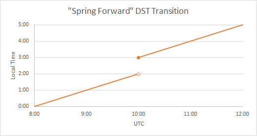

.. raw:: html

   

.. raw:: html

   

.. rubric:: System Development with Python
   :name: system-development-with-python

.. rubric:: Week 6 :: datetime, time, pytz
   :name: week-6-datetime-time-pytz

Joseph Sheedy

*joseph.sheedy@gmail.com*

Git repository:
https://github.com/UWPCE-PythonCert/Python300-SystemDevelopmentWithPython-Spring-2014

.. raw:: html

   

.. raw:: html

   

.. rubric:: datetime, time, pytz
   :name: datetime-time-pytz

.. rubric:: What's so hard about representing time?
   :name: whats-so-hard-about-representing-time

Humans are mostly accustomed to communicating in their local timezone.

There are hundreds of them, whose definitions change

What happens to your application when it's deployed to a server running
in a different timezone?

The length of a day is not constant, and `leap
seconds <http://en.wikipedia.org/wiki/Leap_second>`__ have been inserted
frequently

Daylight savings time challenges

.. raw:: html

   

.. raw:: html

   

.. rubric:: `DST <http://en.wikipedia.org/wiki/Daylight_saving_time>`__
   :name: dst

Daylight savings time creates discontinuities in a time series

|image0|

|image1|

.. raw:: html

   

.. raw:: html

   

.. rubric:: On representing a point in time
   :name: on-representing-a-point-in-time

-  There are two major time standards which you should understand:

   -  `UTC: Coordinated Universal Time (French: Temps Universel
      Coordonné) <http://en.wikipedia.org/wiki/UTC>`__
   -  `UNIX time <http://en.wikipedia.org/wiki/Unix_time>`__

.. raw:: html

   

.. raw:: html

   

.. rubric:: `UTC: Coordinated Universal Time (French: Temps Universel
   Coordonné) <http://en.wikipedia.org/wiki/UTC>`__
   :name: utc-coordinated-universal-time-french-temps-universel-coordonné

This is the primary time standard in the world

Provides a consistent reference all other time zones can relate to

No daylight savings time

Also known as Zulu Time, as the UTC time zone is sometimes denoted by
the letter Z, e.g. 12:59Z

It is similar to, but not the same as, Greenwich Mean Time (GMT). UTC is
more precisely defined

|image2|

.. raw:: html

   

.. raw:: html

   

.. rubric:: `UNIX time <http://en.wikipedia.org/wiki/Unix_time>`__
   :name: unix-time

-  UNIX time is represented as the number of seconds from one point in
   time known as the Epoch, defined to be 00:00 UTC January 1, 1970, not
   counting leap seconds
-  Note that UNIX time is based on another time standard
-  On 32 bit OSes which store time as a signed 32-bit integer, the
   largest value that can be stored is 03:14:07 UTC on Tuesday, 19
   January 2038. One second afterwards, time overflows back to zero.
   This is known as the Y2038 problem.
-  On 64 bit machines, the largest time which can be represented is in
   the year 292 billion, at which time our universe is predicted to not
   exist

.. raw:: html

   

.. raw:: html

   

.. rubric:: timezones and datetime calculations
   :name: timezones-and-datetime-calculations

Calculating the time between two dates spanning timezones, daylight
savings time transitions, and leap seconds is a task fraught with error
The `Olson database <http://en.wikipedia.org/wiki/Tz_database>`__ is a
reference database of the world's timezones.
It can be obtained through the IANA
`here <http://www.iana.org/time-zones>`__
As in `datetime
docs <https://docs.python.org/2.7/library/datetime.html>`__,
    The rules for time adjustment across the world are more political
    than rational

.. raw:: html

   

.. raw:: html

   

.. rubric:: from datetime import time, date, datetime
   :name: from-datetime-import-time-date-datetime

The datetime object represents a specific moment in time

The date object represents a calendar date

The time object represents a time

::

    from datetime import datetime

    t = datetime(2019, 11, 1)
    date = t.date()

    now = datetime.now()

.. raw:: html

   

.. raw:: html

   

.. rubric:: limitations of datetime
   :name: limitations-of-datetime

-  precision is limited to microseconds
-  time range is limited:

   ::

       In [3]: datetime.MINYEAR
       Out[3]: 1

       In [4]: datetime.MAXYEAR
       Out[4]: 9999

       In [5]: datetime.datetime(37337,1,1)
       ---------------------------------------------------------------------------
       ValueError                                Traceback (most recent call last)
        in ()

       ValueError: year is out of range

       In [6]: datetime.datetime(0,1,1)
       ---------------------------------------------------------------------------
       ValueError                                Traceback (most recent call last)
        in ()

       ValueError: year is out of range

-  If you are on a 32-bit OS and using Python pre-2.6, you will be
   limited to the year 2038.

.. raw:: html

   

.. raw:: html

   

.. rubric:: datetime -> string
   :name: datetime---string

::

    from datetime import datetime
    t = datetime.now()
    t.isoformat()
    t.strftime("Date: %B %d, %Y.  Time: %H:%M")

strftime passes format codes to the strftime of the platform's C
library. This may not be standardized! A list of format directives is
`here <https://docs.python.org/2.7/library/datetime.html#strftime-strptime-behavior>`__

getting the current UNIX time :

::

    int(datetime.datetime.now().strftime('%s'))
    # in Python 3.3+:
    datetime.now().timestamp()

.. raw:: html

   

.. raw:: html

   

.. rubric:: string -> datetime
   :name: string---datetime

datetime.strptime(string, format)

::

    In [88]: datetime.datetime.strptime?
    Type:        builtin_function_or_method
    String form: 
    Docstring:   string, format -> new datetime parsed from a string (like time.strptime()).

    time_string = "2019/11/1 2300"
    format = "%Y/%m/%d %H%M"
    datetime.datetime.strptime(time_string, format)

strptime format strings use the same formatting tokens as strftime

If you need to parse arbitrary time strings, or don't want to maintain
format strings, there is
`python-dateutil.parser <http://labix.org/python-dateutil>`__

.. raw:: html

   

.. raw:: html

   

.. rubric:: two types of datetimes - naive and aware
   :name: two-types-of-datetimes---naive-and-aware

so far we haven't created any datetime objects with associated timezone
information, these are known as 'naive' datetimes

in order to accurately represent a real time, timezone information is
required

Some systems may expect naive times to represent UTC, others may decide
on local time zone. It's usually safer to be explicit.

Timezone is specified with the tzinfo attribute, through the
constructor: datetimes are immutable

Change the timezone or another attribute with the replace(\*args,
\*\*kwargs) method to create a new object with all the same attributes
except those specified

tzinfo is expected to be a subclass of datetime.tzinfo

However, datetime.tzinfo is an abstract base class, which means you'll
need to define your own subclass (filled with peril) or install the pytz
package

pytz is based on the `Olson
database <http://en.wikipedia.org/wiki/Tz_database>`__, a reference
database of the world's timezones.

.. raw:: html

   

.. raw:: html

   

.. rubric:: pytz
   :name: pytz

A list of all the timezones in pytz is available in pytz.all\_timezones

Timezone is often specified as a UTC offset in hours, e.g.
2019-11-1T11:59-08:00. Don't use this offset directly to permanently
record a user's timezone because it may change with Daylight Savings
Time. Better to obtain the IANA code from the list in pytz and let
datetime do the calculations.

::

    from datetime import datetime

    import pytz

    t1 = datetime(2019,11,1, tzinfo=pytz.UTC)

    us_pacific_tz = pytz.timezone('US/Pacific')
    t2 = datetime(2019,11,1, tzinfo=us_pacific_tz)

.. raw:: html

   

.. raw:: html

   

.. rubric:: time calculations
   :name: time-calculations

datetime.timedelta([days[, seconds[, microseconds[, milliseconds[,
minutes[, hours[, weeks]]]]]]]) represents a time difference

All the datetime objects overload the arithmetic operators, such that
adding or subtracting dates will return a datetime.timedelta object

::

    In [17]: datetime.datetime.now() - datetime.datetime.now()
    Out[17]: datetime.timedelta(-1, 86399, 999987)

adding timedelta to a datetime will result in a new datetime

::

    In [19]: datetime.datetime(2019,11,1, tzinfo=pytz.UTC) + datetime.timedelta(days=1)
    Out[19]: datetime.datetime(2019, 11, 2, 0, 0)

    # or create a shortcut for creating a UTC timezone aware datetime:
    import functools
    utc = functools.partial(datetime.datetime, tzinfo=pytz.UTC)
    utc(2019,11,1,12,0) + datetime.timedelta(days=1)

.. raw:: html

   

.. raw:: html

   

.. rubric:: time calculations
   :name: time-calculations-1

timedelta has a few functions and properties to retrieve the results:
timedelta.total\_seconds(), timedelta.days, timedelta.seconds,
timedelta.microseconds

datetimes in the calculations must be all naive or all aware

::

    In [35]: datetime.datetime(2019,11,1,tzinfo=pytz.UTC) - datetime.datetime(2019,10,1)
    ---------------------------------------------------------------------------
    TypeError                                 Traceback (most recent call last)
     in ()
    TypeError: can't subtract offset-naive and offset-aware datetimes

        Storing datetimes
        Try to deal in UTC as much as possible.  Do not depend on the machine's interpretation of local time.
        For instance, datetime.now() on my Mac will return a naive datetime containing the local time.  Alternatively:

    # return the current time as an aware datetime in UTC:
    datetime.datetime.now(pytz.UTC)
    # this will return a naive datetime with the current UTC time
    datetime.datetime.utcnow()

When storing a datetime in a database, it will need to be translated
into the database's native format. Depending on the database driver, it
may or may not accept datetimes. If it does, it may or may not respect
the timezone information

Discovering the behavior is part of your database integration work

.. raw:: html

   

.. raw:: html

   

.. rubric:: datetimes in sqlite3
   :name: datetimes-in-sqlite3

From the `sqlite3 docs <http://www.sqlite.org/datatype3.html>`__:

::

    Dates and times in sqlite3 are stored as TEXT, REAL, or INTEGER values

    TEXT as ISO8601 strings ("YYYY-MM-DD HH:MM:SS.SSS").
    REAL as Julian day numbers, the number of days since noon in Greenwich on November 24, 4714 B.C. according to the proleptic Gregorian calendar.
    INTEGER as Unix Time, the number of seconds since 1970-01-01 00:00:00 UTC.

So Python datetime objects must be translated to these types

sqlite3 has support for "adapters" and "converters" to translate types
going in and out of the DB

`Default adapters and
converters <https://docs.python.org/2/library/sqlite3.html#default-adapters-and-converters>`__
are supplied for date and datetime objects

unfortunately, the default implementation does not handle timezone aware
datetimes, but they are simply implementable

let's look at examples/datetime\_naive\_to\_sqlite.py and
examples/datetime\_aware\_to\_sqlite.py

.. raw:: html

   

.. raw:: html

   

.. rubric:: The End
   :name: the-end

.. rubric:: Questions?
   :name: questions

.. raw:: html

   

.. raw:: html

   

`← <#>`__ `→ <#>`__

.. raw:: html

   

 /

.. raw:: html

   

.. |image0| image:: images/6libU.png
   :width: 90.0%

.. |image2| image:: images/Greenwich_clock.jpg
   :width: 30.0%
