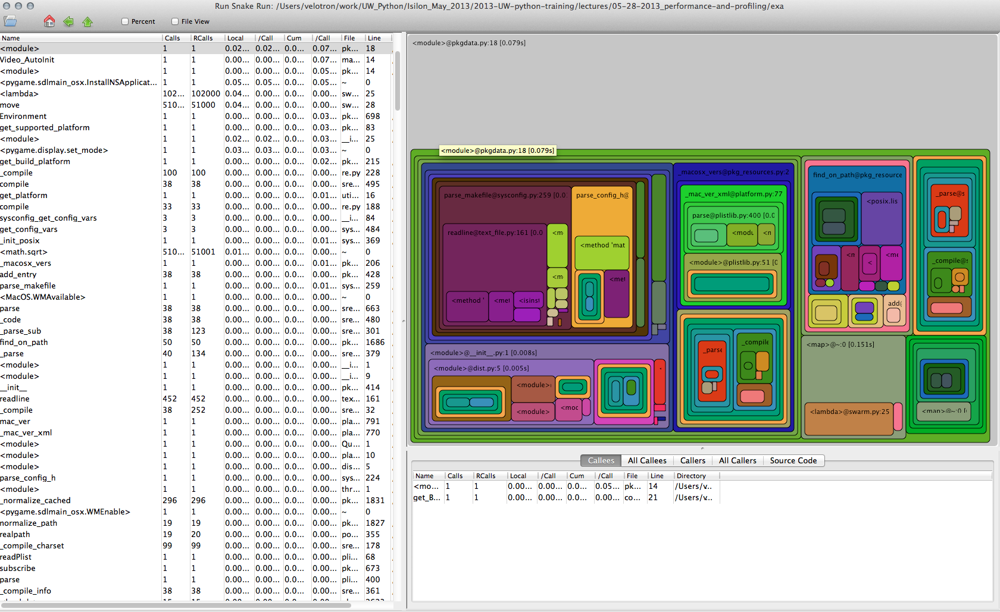

System Development with Python
------------------------------

### Week 9 :: profiling

Joseph Sheedy

*joseph.sheedy@gmail.com*

Git repository:
<https://github.com/UWPCE-PythonCert/SystemDevelopment2015>

Performance and Profiling
-------------------------

### Today's topics

-   Determining performance objectives
-   Measuring performance a.k.a. profiling
-   Performance optimizations

What is software profiling?
---------------------------

The act of using instrumentation to objectively measure the performance
of your application

"Performance" can be a measure of any of the following:

-   resource use (CPU, memory)
-   frequency or duration of function calls
-   wall clock execution time of part or all of your application

Collecting this data involves instrumentating the code. In Python, this
happens at runtime.

The instrumentation creates overhead, so it has a performance cost

The output data (a "profile") will be a statistical summary of the
execution of functions

An optimization strategy
------------------------

1.  Write the code for maintainability / readability
2.  Test for correctness
3.  Collect profile data
4.  If it is fast enough, quit. your job here is done.
5.  Else optimize the most expensive parts based on profiling data
6.  Repeat from 2)

> Programmers waste enormous amounts of time thinking about, or worrying
> about, the speed of noncritical parts of their programs, and these
> attempts at efficiency actually have a strong negative impact when
> debugging and maintenance are considered. We should forget about small
> efficiencies, say about 97% of the time: premature optimization is the
> root of all evil.
>
> *-Donald Knuth*

<http://c2.com/cgi/wiki?PrematureOptimization>
<http://c2.com/cgi/wiki?ProfileBeforeOptimizing>

Big O notation
--------------

The efficency of an algorithm is often described in “big O” notation.

The letter O is used because the growth rate of a function is also
referred to as Order of the function

It describes how an algorithm behaves in terms of resource use as a
function of amount of input data

O(1) - (Constant performance) Execution time stays constant regardless
of how much data is supplied\
Example: adding to dicts

O(n) - Time goes up linearly with number of items.\
Example: scanning lists

O(n^2^) - Time goes up quadratically with number of items.\
Example: bubble sort, worst case

O(log(n)) - goes up with the log of number of items\
Example: bisection search

Reference: [TimeComplexity](https://wiki.python.org/moin/TimeComplexity)
of operations on Python containers

Big O notation
--------------

{width="90%"}

Measuring time with a stopwatch
-------------------------------

One way to measure performance is with a stopwatch.

Start the clock when a unit of code such as a function begins, and stop
it when the code returns

This is a the simplest method, and we can instrument our code to start
and stop the clock.

Like most timing benchmarks, data obtained is valid only for the
particular test environment (machine/OS/Python version..)

Relative timings may be valid across systems, but can also diverge

For instance a run on a machine with fast network and slow disk may
produce much different results on a system with slow network and fast
disk

time.clock() / time.time()
--------------------------

Using the time module as a profiling decorator

time.time() returns the unix system time (wall clock time)

time.clock() returns the CPU time of the current process

Precision is system dependent

See examples/timer/timer\_test.py

    import time

    def timer(func):
        def timer(*args, **kwargs):
            """a decorator which prints execution time of the decorated function"""
            t1 = time.time()
            result = func(*args, **kwargs)
            t2 = time.time()
            print "-- executed %s in %.4f seconds" % (func.func_name, (t2 - t1))
            return result
        return timer

    @timer
    def expensive_function():
        time.sleep(1)

    @timer
    def less_expensive_function():
        time.sleep(.02)

    expensive_function()
    less_expensive_function()

timeit
------

Used for testing small bits of code

Use to test hypotheses about efficiency of algorithms and Python idioms

Will run the given statement many times and calculate the average
execution time

Can be run from the command line:

    python -m timeit '"-".join(str(n) for n in range(100))'

<http://docs.python.org/library/timeit.html>

(See the [timeit.py
source](https://hg.python.org/cpython/file/2.7/Lib/timeit.py))

timeit command line interface
-----------------------------

options

-   -nN: execute the given statement N times in a loop. If this value is
    not given, a fitting value is chosen.
-   -rR: repeat the loop iteration R times and take the best result.
    Default: 3
-   -t: use time.time to measure the time, which is the default on Unix.
    This function measures wall time.
-   -c: use time.clock to measure the time, which is the default on
    Windows and measures wall time. On Unix, resource.getrusage is used
    instead and returns the CPU user time.
-   -pP: use a precision of P digits to display the timing result.
    Default: 3

<!-- -->

    $ python -m timeit -n 1000 -t "len([x**2 for x in range(1000)])"

timeit
------

timeit can also be imported as a module

<http://docs.python.org/2/library/timeit.html#timeit.timeit>

timeit.timeit(stmt='pass', setup='pass', timer=&lt;default timer&gt;,
number=1000000)

The setup kwarg contains a string of Python code to execute before the
loops start, so that code is not part of the test

    import timeit
    statement = "char in text"
    setup_code = """text = "sample string";char = "g" """
    timeit.timeit(statement, setup=setup_code)

timeit via iPython magic
------------------------

Note that the code is passed without quoting it

    %timeit pass

    u = None

    %timeit u is None

    %timeit -r 4 u == None

    import time

    %timeit -n1 time.sleep(2)

    %timeit -n 10000 "f" in "food"

<http://ipython.org/ipython-doc/dev/api/generated/IPython.core.magics.execution.html?highlight=timeit#IPython.core.magics.execution.ExecutionMagics.timeit>

Exercise
--------

We just tried determining if a character exists in a string:

    statement = "'f' in 'food'"
    timeit.timeit(statement)

Run timeit with an alternative statement:

    statement2 = "'food'.find('f') >= 0"
    timeit.timeit(statement2)

Which is faster? Why?

Getting more detailed with Profiling
------------------------------------

A profiler takes measurements of runtime performance and summarizes
results into a profile report

Reported metrics could include

-   Memory used over time
-   Memory allocated per function
-   Frequency of function calls
-   Duration of function calls
-   Cumulative time spent in subfunction calls

Python's builtin profiler
-------------------------

Python comes with a few profiling modules

-   profile - older, pure Python. If you need to extend the profiler,
    this might be good. Otherwise, it's slow.
-   cProfile - same API as profile, but written in C for less overhead
-   hotshot - deprecated, still used sometimes. Emphasis on
    low overhead.

<http://docs.python.org/2/library/profile.html>

<http://docs.python.org/2/library/hotshot.html>

cProfiler
---------

Can be run as a module on an entire application

    python -m cProfile [-o output_file] [-s sort_order] integrate_main.py

    11111128 function calls in 8.283 seconds

    Ordered by: standard name

    ncalls  tottime  percall  cumtime  percall filename:lineno(function)
      1    0.000    0.000    0.000    0.000   integrate.py:1()
    11111110    2.879    0.000    2.879    0.000   integrate.py:1(f)
    [....]

-   ncalls: number of calls
-   tottime: total time spent in function, excluding time in
    sub-functions
-   percall: tottime / ncalls
-   cumtime: total time spent in function, including time in
    sub-functions
-   percall: cumtime / ncalls
-   filename:lineno: location of function

A more complex profile
----------------------

The amount of data in the previous example is readable, so now we'll
look at the output from a more complex application:
examples/pygame/swarm.py

This program consists of calculating the gravitational acceleration of
bodies around a central mass and displaying them

There are two major consumers of resources: one is our own code
calculating the physics, the other is pygame drawing the results on the
screen

Our goal is to figure out whether the major bottleneck is in our own
logic or in the pygame operations

A simple way to get data for our own code is

    python -m cProfile swarm.py  &> /tmp/output.txt
    grep swarm.py /tmp/output.txt
              

cProfiler
---------

Can run a single line of code similar to timeit:

              cProfile.run('None is None')
              

Or from our old demo app examples/wikidef :

              cProfile.run("Definitions.article('python')")
              

Analyzing profile data
----------------------

output to a binary dump with -o &lt;filename&gt;

While doing performance work, save your profiles for comparison later

This helps ensure that any changes do actually increase performance

A profile dump file can be read with pstats

    python -m pstats

pstats
------

    python -m cProfile -o prof_dump  ./define.py Robot
    python -m pstats
    % read prof_dump

    # show stats:
    prof_dump% stats

    # only the top 5 results:
    prof_dump% stats 5

    # sort by cumulative time:
    prof_dump% sort cumulative

    # shorten long filenames for display:
    prof_dump% strip
    # show results again:
    prof_dump% stats 5

pstats
------

pstats also has method calls:

    import pstats
    p = pstats.Stats('prof_dump')
    p.sort_stats('calls', 'cumulative')
    p.print_stats()

    # Output can be restricted via arguments to print_stats().
    # Each restriction is either an integer (to select a count of lines),
    # a decimal fraction between 0.0 and 1.0 inclusive (to select a percentage of lines),
    # or a regular expression (to pattern match the standard name that is printed.
    # If several restrictions are provided, then they are applied sequentially.

    p.print_stats(5)
    p.print_stats('./api.py', 4)
              

Analyzing profile data
----------------------

Inspect only your local code with regular expression syntax:

    import pstats
    prof = pstats.Stats('prof_dump')
    prof.sort_stats('cumulative')
    prof.print_stats('^./[a-z]*.py:')
              

qcachegrind / kcachegrind
-------------------------

profiling tool based on
[Valgrind](http://kcachegrind.sourceforge.net/html/Valgrind.html)

a runtime instrumentation framework for Linux/x86

Can be used with Python profile data with a profile format conversion

Doesn't give all the information that a native valgrind run would
provide

    # convert python profile to calltree format
    pip install pyprof2calltree

    python -m cProfile -o dump.profile integrate_main.py
    pyprof2calltree -i dump.profile -o dump.callgrind
                  

<http://kcachegrind.sourceforge.net/cgi-bin/show.cgi/KcacheGrindCalltreeFormat>

Profiling C extensions
----------------------

[Google Performance Tools](https://code.google.com/p/gperftools/) can be
used to profile C extensions

Just call ProfilerStart and ProfilerStop with ctypes around the code you
want to profile

    import ctypes

    libprof = ctypes.CDLL('/usr/local/lib/libprofiler.0.dylib')
    libprof.ProfilerStart('/tmp/out.prof')
    import numpy
    a=numpy.linspace(0,100)
    a*=32432432
    libprof.ProfilerStop('/tmp/out.prof')

    # convert the profile to qcachegrind's format with google's pprof tool
    $ pprof --callgrind  ~/virtualenvs/uwpce/lib/python2.7/site-packages/numpy/core/multiarray.so out.prof > output.callgrind
    $ qcachegrind output.callgrind
          

Run Snake Run
-------------

A graphical profile viewer for Python

Functions are represented by a
[SquareMap](https://pypi.python.org/pypi/SquareMap/) in which square
size is proportional to time spent in the function

line profiler
-------------

Thus far, we've seen how to collect data on the performance of functions
as atomic units

line\_profiler is a module for doing line-by-line profiling of functions

line\_profiler ships with its own profiler, kernprof.py. Enable
line-by-line profiling with -l

Decorate the function you want to profile with @profile and run

    # the -v option will display the profile data immediately, instead
    # of just writing it to <filename.py>.lprof
    $ kernprof.py -l -v integrate_main.py

    # load the output with
    $ python -m line_profiler integrate_main.py.lprof
          

<http://pythonhosted.org/line_profiler/>

pycallgraph
-----------

Sometimes a quick view of the call graph will help

Python Call Graph is a Python module that creates call graph
visualizations

pycallgraph graphviz ./integrate\_main.py

{width="60%"}

memory profilers
----------------

There aren't any great ones

one option is heapy, which comes with Guppy, a Python environment for
memory profiling

    from guppy import hpy; hp=hpy()
    hp
    hp.doc.heap
    hp.heap()
    %run define.py Robot
    hp.heap()
          

Others
<https://pypi.python.org/pypi/memory_profiler>
<http://mg.pov.lt/objgraph/>
<https://launchpad.net/meliae>
<http://pythonhosted.org/Pympler/muppy.html>
<http://jmdana.github.io/memprof/>

boosting Python performance
---------------------------

-   Overhead in function/method runtime lookup can be significant for
    small frequent calls.
-   inlining code or caching function references might help. See
    examples/data\_aggregation/agg.py
-   Python string handling idioms: use "".join(list\_of\_strings) rather
    than sequential calls to += See examples/strings/str\_concat.py and
    str\_comprehensions.py
-   using list comprehensions, generator expressions, or map() instead
    of for loops can be faster (see data\_aggregation/loops.py)
-   Rewrite expensive code as C modules. Use ctypes, Cython, SWIG, ...
-   Leverage existing domain specific C extension libraries, for
    instance Numpy for fast array operations.

<http://wiki.python.org/moin/PythonSpeed/PerformanceTips/>

Numpy
-----

### A fast array library

Numpy provides mechanisms to create and manipulate large arrays in C
with a Pythonic interface

Advantages:

-   Faster
-   Less memory
-   [Data
    typing](http://docs.scipy.org/doc/numpy/reference/arrays.dtypes.html)
-   N-d array slicing
-   Vector operations

Many projects involving gridded data use numpy arrays:

-   PyOpenGL
-   GDAL (Geospatial Data Abstraction Library)
-   NetCDF4 (file format for large gridded data sets)
-   Shapely (for GIS work)
-   PIL (Python Image Library)

Numpy
-----

Numpy arrays can be created by passing a sequence to numpy.array(), or
generated from scratch with methods like zeros(), empty(), arange(), ...

Numpy arrays can share data

Creating a slice of an array generates a reference to that slice, it
does not copy the data, saving memory and improving performance

    import numpy
    # create a 2D array
    x = numpy.array(((1,2,3), (4,5,6), (7,8,9)))
    # take a vertical slice
    y = x[:,1]
    # changing a value in x..
    x[0][1] = 99
    # changes the value in y
    print y[0]
                      

Fast serialization with numpy.tofile() / numpy.fromfile() – Just the raw
bytes, no metadata

Numpy
-----

Operations on a numpy array

Broadcasting: specifies an operation to broadcast across the array. e.g.
`my_array*3` will broadcast the (\*3) operation on each element, at the
C level, not the Python level.

See examples/numpy/matrix.py

Numpy has a [large number of
methods](http://docs.scipy.org/doc/numpy/reference/routines.html) for
operating on the arrays, for slicing, vector calculations, and
statistics

Exercise
--------

examples/numpy/images.py contains a script to manipulate an image's
pixel data with numpy

Before saving a new copy of the image, mirror the image either
horizontally or vertically

Managing memory
---------------

Don’t forget memory:

Processors are fast

It can take longer to push the memory around than do the computation

So keep in in mind for big data sets:

Use the right data structures

Use efficient algorithms

Use generators, rather than lists: xrange, ...

Use iterators to pull in the data you need from databases, sockets,
files, ...

Questions?
==========

[←](# "Previous"){.deck-prev-link} [→](# "Next"){.deck-next-link}

 / 

