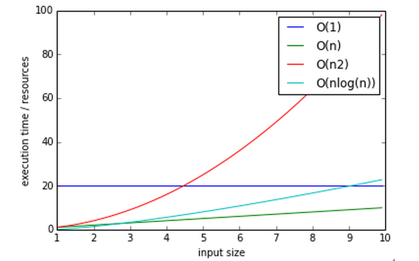

.. _profiling:

*************************
Performance and Profiling
*************************

==============
Today's topics
==============

.. rst-class:: left medium

  -  Determining performance objectives
  -  Measuring performance a.k.a. profiling
  -  Performance optimizations

What is Software Profiling
--------------------------

The act of using instrumentation to objectively measure the performance
of your application

"Performance" can be a measure of any of the following:

-  resource use (CPU, memory)
-  frequency or duration of function calls
-  wall clock execution time of part or all of your application

Collecting this data involves instrumentating the code. In Python, this
happens at runtime.

The instrumentation creates overhead, so it has a performance cost

The output data (a "profile") will be a statistical summary of the
execution of functions

An optimization strategy
------------------------

#. Write the code for maintainability / readability
#. Test for correctness
#. Collect profile data
#. If it is fast enough, quit. Your job here is done.
#. Else optimize the most expensive parts based on profiling data
#. Repeat from 2)

.. nextslide::

Programmers waste enormous amounts of time thinking about, or
worrying about, the speed of noncritical parts of their programs,
and these attempts at efficiency actually have a strong negative
impact when debugging and maintenance are considered. We should
forget about small efficiencies, say about 97% of the time:

*premature optimization is the root of all evil.*

--Donald Knuth

http://c2.com/cgi/wiki?PrematureOptimization

http://c2.com/cgi/wiki?ProfileBeforeOptimizing

Steps to better performance
---------------------------

(In order of importance)

#. Efficient Algorithms (big O, etc...)
#. Appropriate Python data types, etc.
#. Appropriate Python style
#. Specialized packages (numpy, scipy)
#. Calling external packages
#. Extending with C/C++/Fortran/Cython

Big O notation
--------------

The efficiency of an algorithm is often described in “big O” notation.

The letter O is used because the growth rate of a function is also
referred to as Order of the function

It describes how an algorithm behaves in terms of resource use as a
function of amount of input data

.. nextslide::

O(1) - (Constant performance) Execution time stays constant regardless of how much data is supplied

- Example: adding to a dict

O(n) - Time goes up linearly with number of items.

- Example: scanning lists

O(n\ :sup:`2`) - Time goes up quadratically with number of items.

- Example: bubble sort, worst case

O(log(n)) - goes up with the log of number of items

- Example: bisection search

.. nextslide::

..      :align: right
..      :height: 450px
      :alt: big O notation plot

.. nextslide::

**log?** you expect me to remember that math???

Let's think about that a bit....

Anyone know what a bisection search is?

Why is that O(log(n))?

|

Reference:

https://wiki.python.org/moin/TimeComplexity

Measuring time with a stopwatch
-------------------------------

One way to measure performance is with a stopwatch.

Start the clock when a unit of code such as a function begins, and stop
it when the code returns

This is a the simplest method, and we can instrument our code to start
and stop the clock.

Like most timing benchmarks, data obtained is valid only for the
particular test environment (machine/OS/Python version..)

Relative timings may be valid across systems, but can also diverge

For instance a run on a machine with fast network and slow disk may
produce much different results on a system with slow network and fast
disk

``time.clock()`` / ``time.time()``
----------------------------------

Using the time module as a profiling decorator

``time.time()`` returns the unix system time (wall clock time)

``time.clock()`` returns the CPU time of the current process

Precision is system dependent

Quite course, but can capture the big picture

See ``Examples/profiling/timer/timer_test.py``

.. nextslide::

.. code-block:: python

    import time

    def timer(func):
        def timer(*args, **kwargs):
            """a decorator which prints execution time of the decorated function"""
            t1 = time.time()
            result = func(*args, **kwargs)
            t2 = time.time()
            print("-- executed %s in %.4f seconds" % (func.func_name, (t2 - t1)))
            return result
        return timer

    @timer
    def expensive_function():
        time.sleep(1)

    @timer
    def less_expensive_function():
        time.sleep(.02)

    expensive_function()
    less_expensive_function()

timeit
------

Used for testing small bits of code

Use to test hypotheses about efficiency of algorithms and Python idioms

Will run the given statement many times and calculate the average
execution time

Can be run from the command line:

.. code-block:: python

    python -m timeit '"-".join(str(n) for n in range(100))'

https://docs.python.org/3.5/library/timeit.html

See the ``timeit.py`` source:

https://hg.python.org/cpython/file/3.5/Lib/timeit.py

``timeit`` command line interface
---------------------------------

options

-  ``-nN``: execute the given statement N times in a loop. If this value is
   not given, a fitting value is chosen.
-  ``-rR``: repeat the loop iteration R times and take the best result.
   Default: 3
-  ``-t``: use time.time to measure the time, which is the default on Unix.
   This function measures wall time.
-  ``-c``: use time.clock to measure the time, which is the default on
   Windows and measures wall time. On Unix, resource.getrusage is used
   instead and returns the CPU user time.
-  ``-pP``: use a precision of P digits to display the timing result.
   Default: 3

.. code-block:: bash

    $ python -m timeit -n 1000 -t "len([x**2 for x in range(1000)])"

.. nextslide::

``timeit`` can also be imported as a module

http://docs.python.org/3/library/timeit.html#timeit.timeit

.. code-block:: python

  timeit.timeit(stmt='pass',
                setup='pass',
                timer=<default timer>,
                number=1000000)

The setup kwarg contains a string of Python code to execute before the
loops start, so that code is not part of the test

.. code-block:: python

    import timeit
    statement = "char in text"
    setup_code = """text = "sample string";char = "g" """
    timeit.timeit(statement, setup=setup_code)

``timeit`` via iPython magic
----------------------------

Note that all that setup_code stuff is kind of a pain.

iPython has your back (again)

.. code-block:: ipython

    %timeit pass

    u = None
    %timeit u is None

    %timeit -r 4 u == None

    import time
    %timeit -n1 time.sleep(2)

    %timeit -n 10000 "f" in "food"

http://ipython.readthedocs.io/en/stable/interactive/magics.html?#magic-timeit

Exercise
--------
We just tried determining if a character exists in a string:

.. code-block:: python

    statement = "'f' in 'food'"
    timeit.timeit(statement)

Run timeit with an alternative statement:

.. code-block:: python

    statement2 = "'food'.find('f') >= 0"
    timeit.timeit(statement2)

Which is faster? Why?

Getting more detailed with Profiling
------------------------------------

That kind of timing is only useful if you know what part of the code you want to optimize.

But what if you know your program is "slow", but don't know where is is spending the time?

**Do not Guess!** -- you will often be wrong, and you don't want to waste time optimizing the wrong thing.

*Really* -- even very experienced programmers are often wrong about where the bottlenecks are.

You really need to profile to be sure.

Also: take into account the entire run-time: does it make sense to optimize an initialization routine that takes a few seconds before a multi-hour run?

.. nextslide::

A profiler takes measurements of runtime performance and summarizes results into a profile report

Reported metrics could include

-  Memory used over time
-  Memory allocated per function
-  Frequency of function calls
-  Duration of function calls
-  Cumulative time spent in subfunction calls

Python's built-in profilers
---------------------------

Python comes with a couple profiling modules

-  profile - older, pure Python. If you need to extend the profiler,
   this might be good. Otherwise, it's slow.

-  cProfile - same API as profile, but written in C for less overhead

**You almost always want to use ``cProfile``**

https://docs.python.org/3.5/library/profile.html

cProfile
--------

Can be run as a module on an entire application

.. code-block:: bash

    python -m cProfile [-o output_file] [-s sort_order] read_bna.py
    11111128 function calls in 8.283 seconds
    Ordered by: standard name

    ncalls  tottime  percall  cumtime  percall filename:lineno(function)
      1    0.000    0.000    0.000    0.000   integrate.py:1()
    11111110    2.879    0.000    2.879    0.000   integrate.py:1(f)
    [....]

-  ncalls: number of calls
-  tottime: total time spent in function, excluding time in sub-functions
-  percall: tottime / ncalls
-  cumtime: total time spent in function, including time in sub-functions
-  percall: cumtime / ncalls
-  filename:lineno -- location of function

Analyzing profile data
----------------------

Output to a binary dump with -o <filename>

While doing performance work, save your profiles for comparison later

This helps ensure that any changes do actually increase performance

A profile dump file can be read with ``pstats``

.. code-block:: bash

    python -m pstats

Gives you a command line interface

(help for help...)

``pstats``
----------

.. code-block:: python

    python -m cProfile -o prof_dump  ./read_bna.py
    python -m pstats
    % read prof_dump

    # show stats:
    prof_dump% stats

    # only the top 5 results:
    prof_dump% stats 5

    # sort by cumulative time:
    prof_dump% sort cumulative

    # shorten long filenames for display:
    prof_dump% strip
    # show results again:
    prof_dump% stats 5

.. nextslide::

pstats also has method calls:

.. code-block:: python

    import pstats
    p = pstats.Stats('prof_dump')
    p.sort_stats('calls', 'cumulative')
    p.print_stats()

    # Output can be restricted via arguments to print_stats().
    # Each restriction is either an integer (to select a count of lines),
    # a decimal fraction between 0.0 and 1.0 inclusive (to select a percentage of lines),
    # or a regular expression (to pattern match the standard name that is printed.
    # If several restrictions are provided, then they are applied sequentially.

Analyzing profile data
----------------------

Inspect only your local code with regular expression syntax:

.. code-block:: python

    import pstats
    prof = pstats.Stats('prof_dump')
    prof.sort_stats('cumulative')
    prof.print_stats('^./[a-z]*.py:')

I tend to write little scripts like this so I don't have to remember the commands.

Exercise / Example
------------------

Real world example:

``Examples/profiling/bna_reader/read_bna.py``

BNA is a (old) text file format for holding geospatial data.

We were using some old code of mine that read these files, generated an internal data structure of polygons, and rendered them to a PNG.

As these files got big -- this process started getting really slow.

I had already optimized the file reading code a lot -- so could we do better?

  - I assumed not

One of my team ran the profiler and identified the bottleneck -- and yes -- we could do better -- a lot.

Let's try that out now.

============================
Some other tools to consider
============================

For better visualizing

For C extensions

For memory Profiling

SNAKEVIZ
--------

A graphical profile viewer for Python

https://jiffyclub.github.io/snakeviz/

Inspired by "Run Snake Run": http://www.vrplumber.com/programming/runsnakerun/

(which only works with Python 2.* for now)

.. image:: images/snakeviz.png
..      :align: right
..      :height: 450px
      :alt: snakeviz visualization

line profiler
-------------

Thus far, we've seen how to collect data on the performance of functions
as atomic units

``line_profiler`` is a module for doing line-by-line profiling of functions

``line_profiler`` ships with its own profiler, ``kernprof.py``.

Enable line-by-line profiling with -l

Decorate the function you want to profile with ``@profile`` and run

.. code-block:: bash

    # the -v option will display the profile data immediately, instead
    # of just writing it to <filename.py>.lprof
    $ kernprof -l -v integrate_main.py

    # load the output with
    $ python -m line_profiler integrate_main.py.lprof

https://github.com/rkern/line_profiler

qcachegrind / kcachegrind
-------------------------

profiling tool based on Valgrind:

http://kcachegrind.sourceforge.net/html/Valgrind.html

a runtime instrumentation framework for Linux/x86

Can be used with Python profile data with a profile format conversion

Doesn't give all the information that a native valgrind run would
provide

.. code-block:: python

    # convert python profile to calltree format
    pip install pyprof2calltree

    python -m cProfile -o dump.profile integrate_main.py
    pyprof2calltree -i dump.profile -o dump.callgrind

http://kcachegrind.sourceforge.net/cgi-bin/show.cgi/KcacheGrindCalltreeFormat

Profiling C extensions
----------------------

Google Performance Tools:

https://code.google.com/p/gperftools/

can be used to profile C extensions

Just call ProfilerStart and ProfilerStop with ctypes around the code you
want to profile

.. nextslide::

.. code-block:: python

    import ctypes

    libprof = ctypes.CDLL('/usr/local/lib/libprofiler.0.dylib')
    libprof.ProfilerStart('/tmp/out.prof')
    import numpy
    a=numpy.linspace(0,100)
    a*=32432432
    libprof.ProfilerStop('/tmp/out.prof')

.. code-block:: bash

    # convert the profile to qcachegrind's format with google's pprof tool
    $ pprof --callgrind  ~/virtualenvs/uwpce/lib/python2.7/site-packages/numpy/core/multiarray.so out.prof > output.callgrind
    $ qcachegrind output.callgrind

memory profilers
----------------

There aren't any great ones

One option is heapy, which comes with Guppy, a Python environment for
memory profiling

.. code-block:: python

    from guppy import hpy; hp=hpy()
    hp.doc.heap
    hp.heap()
    %run define.py Robot
    hp.heap()

Others:

https://pypi.python.org/pypi/memory_profiler

http://mg.pov.lt/objgraph/

https://launchpad.net/meliae

http://pythonhosted.org/Pympler/muppy.html

http://jmdana.github.io/memprof/

============================
Boosting Python performance
============================

There are ways to better structure your Python code to improve performance

A few key approaches
--------------------

-  Overhead in function/method runtime lookup can be significant for
   small frequent calls.

-  inlining code or caching function references might help. See
   ``examples/data_aggregation/agg.py``

-  Python string handling idioms: use ``"".join(list_of_strings)`` rather
   than sequential calls to += See ``examples/strings/str_concat.py`` and
   ``str_comprehensions.py``

-  using list comprehensions, generator expressions, ``or map()`` instead of
   for loops can be faster (see ``data_aggregation/loops.py``)

-  Leverage existing domain specific C extension libraries, for instance
   Numpy for fast array operations.

-  Rewrite expensive code as C modules. Use ctypes, Cython, SWIG, ...

http://wiki.python.org/moin/PythonSpeed/PerformanceTips/

Managing memory
---------------

Don’t forget memory:

Processors are fast

It can take longer to push the memory around than do the computation

So keep in in mind for big data sets:

Use the right data structures

Use efficient algorithms

Use generators and iterators, rather than lists.

Use iterators to pull in the data you need from databases, sockets,
files, ...

Distraction: pyGame
-------------------

There is a nice profiling example that uses PyGame:

http://www.pygame.org/hifi.html

Which you can install from binaries:

Windows:
http://www.lfd.uci.edu/~gohlke/pythonlibs/#pygame

(you want the wheel file for the python you are running: probably cp35)

Anaconda Python:

First install miniconda. Then you can install pygame from anaconda.org.

https://anaconda.org/cogsci

A more complex profile
----------------------

The amount of data in the previous example is readable, so now we'll
look at the output from a more complex application:
examples/profiling/pygame/swarm.py

This program consists of calculating the gravitational acceleration of
bodies around a central mass and displaying them

There are two major consumers of resources: one is our own code
calculating the physics, the other is pygame drawing the results on the
screen

Our goal is to figure out whether the major bottleneck is in our own
logic or in the pygame operations

A simple way to get data for our own code is

.. code-block:: python

    python -m cProfile swarm.py  &> /tmp/output.txt
    grep swarm.py /tmp/output.txt

Questions?
----------
