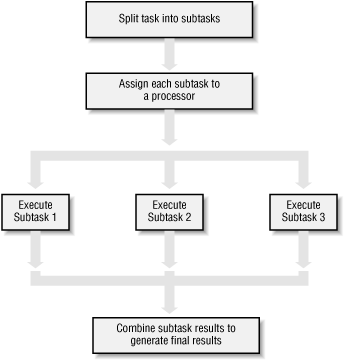

.. _threading:

#############################
Threading and multiprocessing
#############################

Threading / multiprocessing
===========================

Today's topics:

-  Threading / multiprocessing motivation and options
-  threading module
-  multiprocessing module
-  other options

Motivations for parallel execution
----------------------------------

-  Performance

   -  Limited by "Amdahl's Law"
      http://en.wikipedia.org/wiki/Amdahl%27s_law

   -  CPUs aren't getting much faster

-  Event handling

   - If a system handles asynchronous events, a seperate thread of
     execution could handle those events and let other threads do other
     work

   - Examples:

     -  Network applications

     -  User interfaces

Parallel programming can be hard!

If your problem can be solved sequentially, consider the costs and
benefits before going parallel.

Parallelization strategy for performance
----------------------------------------

1. Break problem down into chunks
2. Execute chunks in parallel
3. Reassemble output of chunks into result

.. nextslide::

Parallelization strategy for performance
----------------------------------------

-  Not every problem is parallelizable
-  There is an optimal number of threads for each problem in each
   environment, so make it tunable
-  Working concurrently opens up synchronization issues
-  Methods for synchronizing threads:

   -  locks
   -  queues
   -  signaling/messaging mechanisms

Threads versus processes in Python
----------------------------------

Threads are lightweight processes_, run in the address space of an OS
process, true OS level threads.

Therefor, a component of a a process.

.. _processes: https://en.wikipedia.org/wiki/Light-weight_process

This allows multiple threads access to data in the same scope.

Threads can not gain the performance advantage of multiple processors
due to the Global Interpreter Lock (GIL)

But the GIL is released during IO, allowing IO bound processes to
benefit from threading

Processes
---------

A process contains all the instructions and data required to execute
independently, so processes do not share data!

Mulitple processes best to speed up CPU bound operations. 

The Python interpreter isn't lightweight!

Communication between processes can be achieved via
``multiprocessing.Queue``, ``multiprocessing.Pipe``, and regular IPC (inter-process communication)

Data moved between processes must be pickleable

GIL
---

**Global Interpreter Lock**

This is a lock which must be obtained by each thread before it can
execute, ensuring thread safety

.. image:: images/gil.png
    :width: 100.0%

.. nextslide::

The GIL is released during IO operations, so threads which spend time
waiting on network or disk access can enjoy performance gains

The GIL is not unlike multitasking in humans, some things can truly be 
done in parallel, others have to be done by time slicing.

Note that potentially blocking or long-running operations, such as I/O, image processing, and NumPy number crunching, happen outside the GIL. Therefore it is only in multithreaded programs that spend a lot of time inside the GIL, interpreting CPython bytecode, that the GIL becomes a bottleneck. But: it can still cause performance degradation.

Not only will threads not help cpu-bound problems, but it can actually make things worse, especially on multi-core machines!

.. nextslide::

Some alternative Python implementations such as Jython and IronPython
have no GIL

cPython and PyPy have one

More Information on the Gil

-  https://www.youtube.com/watch?v=Obt-vMVdM8s David Beazley's talk on the gil
-  http://wiki.python.org/moin/GlobalInterpreterLock
-  https://docs.python.org/3.5/c-api/init.html#threads
-  http://hg.python.org/cpython/file/05e8dde3229c/Python/pystate.c#l761

Posted without comment
----------------------

A CPU bound problem
-------------------

Numerically integrate the function `y =
x\`  :sup:`2` <http://www.wolframalpha.com/input/?i=x%5E2>`__ from 0 to
10.

.. image:: images/x2.png

Solution: http://www.wolframalpha.com/input/?i=int(x%5E2,0,10)

Parallel execution example
--------------------------

Consider the following code from

``Examples/integrate/integrate.py``

.. code-block:: python

    def f(x):
        return x**2

    def integrate(f, a, b, N):
        s = 0
        dx = (b-a)/N
        for i in xrange(N):
            s += f(a+i*dx)
        return s * dx

    print(integrate(f, 0, 10, 100))

Break down the problem into parallelizable chunks, then add the results
together:

We can do better than this

The threading module
--------------------

Starting threads doesn't take much:

.. code-block:: python

    import sys
    import threading
    import time

    def func():
        for i in xrange(5):
            print("hello from thread %s" % threading.current_thread().name)
            time.sleep(1)

    threads = []
    for i in xrange(3):
        thread = threading.Thread(target=func, args=())
        thread.start()
        threads.append(thread)

.. nextslide::

-  The process will exit when the last non-daemon thread exits.
-  A thread can be specified as a daemon thread by setting its daemon
   attribute: ``thread.daemon = True``
-  daemon threads get cut off at program exit, without any opportunity
   for cleanup. But you don't have to track and manage them. Useful for
   things like garbage collection, network keepalives, ..
-  You can block and wait for a thread to exit with thread.join()

Subclassing Thread
------------------

You can adding threading capability to your own classes

Subclass Thread and implement the run method

.. code-block:: python

    import threading

    class MyThread(threading.Thread):

        def run(self):
            print("hello from %s" % threading.current_thread().name)
        
    thread = MyThread()
    thread.start()

Race Conditions
---------------

In the last example we saw threads competing for access to stdout.

Worse, if competing threads try to update the same value, we might get
an unexpected race condition

Race conditions occur when multiple statements need to execute
atomically, but get interrupted midway

See ``Examples/race_condition.py``

.. nextslide::

+--------------------+--------------------+--------------------+--------------------+
| Thread 1           | Thread 2           |                    | Integer value      |
+====================+====================+====================+====================+
|                    |                    |                    | 0                  |
+--------------------+--------------------+--------------------+--------------------+
| read value         |                    | ←                  | 0                  |
+--------------------+--------------------+--------------------+--------------------+
| increase value     |                    |                    | 0                  |
+--------------------+--------------------+--------------------+--------------------+
| write back         |                    | →                  | 1                  |
+--------------------+--------------------+--------------------+--------------------+
|                    | read value         | ←                  | 1                  |
+--------------------+--------------------+--------------------+--------------------+
|                    | increase value     |                    | 1                  |
+--------------------+--------------------+--------------------+--------------------+
|                    | write back         | →                  | 2                  |
+--------------------+--------------------+--------------------+--------------------+

.. nextslide::

+--------------------+--------------------+--------------------+--------------------+
| Thread 1           | Thread 2           |                    | Integer value      |
+====================+====================+====================+====================+
|                    |                    |                    | 0                  |
+--------------------+--------------------+--------------------+--------------------+
| read value         |                    | ←                  | 0                  |
+--------------------+--------------------+--------------------+--------------------+
|                    | read value         | ←                  | 0                  |
+--------------------+--------------------+--------------------+--------------------+
| increase value     |                    |                    | 0                  |
+--------------------+--------------------+--------------------+--------------------+
|                    | increase value     |                    | 0                  |
+--------------------+--------------------+--------------------+--------------------+
| write back         |                    | →                  | 1                  |
+--------------------+--------------------+--------------------+--------------------+
|                    | write back         | →                  | 1                  |
+--------------------+--------------------+--------------------+--------------------+

http://en.wikipedia.org/wiki/Race_condition

Deadlocks
---------

Synchronization and Critical Sections are used to control race
conditions

But they introduce other potential problems...

like: http://en.wikipedia.org/wiki/Deadlock

"A deadlock is a situation in which two or more competing actions are
each waiting for the other to finish, and thus neither ever does."

*When two trains approach each other at a crossing, both shall come to a
full stop and neither shall start up again until the other has gone*

See also *Livelock*: *Two people meet in a narrow corridor, and each
tries to be polite by moving aside to let the other pass, but they end
up swaying from side to side without making any progress because they
both repeatedly move the same way at the same time.*

Locks
-----

Lock objects allow threads to control access to a resource until they're
done with it

This is known as mutual exclusion, often called mutex

Python 2 has a deprecated module called mutex for this. Use a Lock
instead.

A Lock has two states: locked and unlocked

If multiple threads have access to the same Lock, they can police
themselves by calling its ``.acquire()`` and ``.release()`` methods

If a Lock is locked, .acquire will block until it becomes unlocked

These threads will wait in line politely for access to the statements in
f()

.. nextslide::

.. code-block:: python

    import threading
    import time

    lock = threading.Lock()

    def f():
        lock.acquire()
        print("%s got lock" % threading.current_thread().name)
        time.sleep(1)
        lock.release()

    threading.Thread(target=f).start()
    threading.Thread(target=f).start()
    threading.Thread(target=f).start()

Nonblocking Locking
-------------------

``.acquire()`` will return True if it successfully acquires a lock

Its first argument is a boolean which specifies whether a lock should
block or not. The default is ``True``

.. code-block:: python

    import threading
    lock = threading.Lock()
    lock.acquire()
    if not lock.acquire(False):
        print("couldn't get lock")
    lock.release()
    if lock.acquire(False):
        print("got lock")

``threading.RLock`` - Reentrant Lock
------------------------------------

Useful for recursive algorithms, a thread-specific count of the locks is
maintained

A reentrant lock can be acquired multiple times by the same thread

``Lock.release()`` must be called the same number of times as ``Lock.acquire()``
by that thread

``threading.Semaphore``
-----------------------

Like an ``RLock``, but in reverse

A Semaphore is given an initial counter value, defaulting to 1

Each call to ``acquire()`` decrements the counter, ``release()`` increments it

If ``acquire()`` is called on a Semaphore with a counter of 0, it will block
until the Semaphore counter is greater than 0.

Useful for controlling the maximum number of threads allowed to access a
resource simultaneously

http://en.wikipedia.org/wiki/Semaphore_(programming)

Locking Exercise
----------------

find ``Examples/lock/stdout_writer.py``

multiple threads in the script write to stdout, and their output gets
jumbled

1. Add a locking mechanism to give each thread exclusive access to
   stdout
1. Try adding a Semaphore to allow 2 threads access at once

Managing thread results
-----------------------

We need a thread safe way of storing results from multiple threads of
execution. That is provided by the Queue module.

Queues allow multiple producers and multiple consumers to exchange data
safely

Size of the queue is managed with the maxsize kwarg

It will block consumers if empty and block producers if full

If maxsize is less than or equal to zero, the queue size is infinite

.. code-block:: python

    from Queue import Queue
    q = Queue(maxsize=10)
    q.put(37337)
    block = True
    timeout = 2
    print(q.get(block, timeout))

-  http://docs.python.org/3/library/threading.html
-  http://docs.python.org/3/library/queue.html

Other Queue types
-----------------

``Queue.LifoQueue`` - Last In, First Out

``Queue.PriorityQueue`` - Lowest valued entries are retrieved first

One pattern for PriorityQueue is to insert entries of form data by
inserting the tuple: ``(priority_number, data)``

Threading example
-----------------

See Examples/threading/integrate_main.py

.. code-block::python

    #!/usr/bin/env python

    import argparse
    import os
    import sys
    import threading
    import Queue

    sys.path.append(os.path.join(os.path.dirname(__file__), ".."))
    from integrate.integrate import integrate, f
    from decorators.decorators import timer

    @timer
    def threading_integrate(f, a, b, N, thread_count=2):
        """break work into two chunks"""
        N_chunk = int(float(N) / thread_count)
        dx = float(b-a) / thread_count

        results = Queue.Queue()

        def worker(*args):
            results.put(integrate(*args))

        threads = []
        for i in xrange(thread_count):
            x0 = dx*i
            x1 = x0 + dx
            thread = threading.Thread(target=worker, args=(f, x0, x1, N_chunk))
            thread.start()
            print "Thread %s started" % thread.name
            # thread1.join()

        return sum( (results.get() for i in xrange(thread_count) ))

    if __name__ == "__main__":
        parser = argparse.ArgumentParser(description='integrator')
        parser.add_argument('a', nargs='?', type=float, default=0.0)
        parser.add_argument('b', nargs='?', type=float, default=10.0)
        parser.add_argument('N', nargs='?', type=int, default=10**7)
        parser.add_argument('thread_count', nargs='?', type=int, default=2)

        args = parser.parse_args()
        a = args.a
        b = args.b
        N = args.N
        thread_count = args.thread_count

        print "Numerical solution with N=%(N)d : %(x)f" % \
                {'N': N, 'x': threading_integrate(f, a, b, N, thread_count=thread_count)}

Threading on a CPU bound problem
--------------------------------

Try running the code in examples/threading/integrate\_main.py

It accepts 4 arguments:

.. code-block:; python

    ./integrate_main.py -h
    usage: integrate_main.py [-h] [a] [b] [N] [thread_count]

    integrator

    positional arguments:
      a
      b
      N
      thread_count

``./integrate_main.py 0 10 1000000 4``

What happens when you change the thread count? What thread count gives
the maximum speed?

multiprocessing
---------------

multiprocessing provides an API very similar to threading, so the
transition is easy

use multiprocessing.Process instead of threading.Thread

.. code-block:: python

    import multiprocessing
    import os
    import time

    def func():
        print "hello from process %s" % os.getpid()
        time.sleep(1)

    proc = multiprocessing.Process(target=func, args=())
    proc.start()
    proc = multiprocessing.Process(target=func, args=())
    proc.start()

Differences with threading
--------------------------

Multiprocessing has its own multiprocessing.Queue which handles
interprocess communication

Also has its own versions of Lock, RLock, Semaphore

.. code-block:: python

    from multiprocessing import Queue, Lock

``multiprocessing.Pipe`` for 2-way process communication:

.. code-block:: python

    from multiprocessing import Pipe
    parent_conn, child_conn = Pipe()
    child_conn.send("foo")
    print parent_conn.recv()

Pooling
-------

A processing pool contains worker processes with only a configured
number running at one time

.. code-block:: python

    from multiprocessing import Pool
    pool = Pool(processes=4)

The Pool module has several methods for adding jobs to the pool

-  apply_async(func[, args[, kwargs[, callback]]])
-  map_async(func, iterable[, chunksize[, callback]])

Pooling example
---------------

.. code-block:: python

    from multiprocessing import Pool

    def f(x):
        return x*x

    if __name__ == '__main__':
        pool = Pool(processes=4)

        result = pool.apply_async(f, (10,))
        print result.get(timeout=1)

        print pool.map(f, range(10))

        it = pool.imap(f, range(10))
        print it.next()
        print it.next()
        print it.next(timeout=1)

        import time
        result = pool.apply_async(time.sleep, (10,))
        print result.get(timeout=1)

http://docs.python.org/2/library/multiprocessing.html#module-multiprocessing.pool

ThreadPool
----------

Threading also has a pool

Confusingly, it lives in the multiprocessing module

::

          from multiprocessing.pool import ThreadPool
          pool = ThreadPool(processes=4)

threading versus multiprocessing, networking edition
----------------------------------------------------

We're going to test making concurrent connections to a web service in
``Examples/server/app.py``

It is a WSGI application which can be run with Green Unicorn or another
WSGI server

::

    $ gunicorn app:app --bind 0.0.0.0:37337

``client-threading.py`` makes 100 threads to contact the web service

``client-mp.py`` makes 100 processes to contact the web service

``client-pooled.py`` creates a ThreadPool

``client-pooled.py`` contains a results Queue, but doesn't use it. Can you
collect all the output from the pool into a single data structure using
this Queue?

Other options
-------------

Traditionally, concurency has been achieved through multiple process
communication and in-process threads, as we've seen

Another strategy is through micro-threads, implemented via coroutines
and a scheduler

A coroutine is a generalization of a subroutine which allows multiple
entry points for suspending and resuming execution

the threading and the multiprocessing modules follow a `preemptive
multitasking
model <http://en.wikipedia.org/wiki/Preemption_(computing)>`__

coroutine based solutions follow a `cooperative multitasking
model <http://en.wikipedia.org/wiki/Computer_multitasking#Cooperative_multitasking.2Ftime-sharing>`__

-  `http://dabeaz.com/coroutines/, A Curious Course on Coroutines and
   Concurrency <http://dabeaz.com/coroutines/>`__
-  http://en.wikipedia.org/wiki/Coroutine

With send(), a generator becomes a coroutine
--------------------------------------------

::

    def coroutine(n):
        try:
            while True:
                x = (yield)
                print n+x
        except GeneratorExit:
            pass

    targets = [
     coroutine(10),
     coroutine(20),
     coroutine(30),
    ]

    for target in targets:
        target.next()

    for i in range(5):
        for target in targets:
            target.send(i)

http://dabeaz.com/coroutines/Coroutines.pdf

Packages using coroutines for micro threads
-------------------------------------------

By "jumping" to parallel coroutines, our application can simulate true
threads.

Creating the scheduler which does the jumping is an exercise for the
reader, but look into these packages which handle the dirty work

-  https://pypi.python.org/pypi/greenlet - interface for creating
   coroutine based microthreads
-  http://eventlet.net/ - a concurrent networking library, based on
   greenlet. Developed for Second Life
-  http://www.gevent.org - forked from eventlet. Built on top of
   greenlet and libevent, a portable event loop with strong OS support
-  Python 3.4+ : the asyncio module

Distributed programming
-----------------------

A distributed system is one in which components located on networked
computers communicate and coordinate their actions by passing messages

There are lots of ways to do this at different layers. MPI, \*-RPC,
Pyro, ...

Celery
------

"Celery is an asynchronous task queue/job queue based on distributed
message passing"

Provides an API for defining tasks, and retrieving results from those
tasks

Messages are passed via a "message broker", of which Celery supports
several:

-  RabbitMQ (default)
-  Redis
-  MongoDB
-  Amazon SQS
-  ...

Celery worker processes are run on compute nodes, while the main process
farms jobs out to them. http://www.celeryproject.org/

Celery in one minute
--------------------

::

    # tasks.py

    from celery import Celery

    celery = Celery('tasks', backend="amqp", broker='amqp://guest@localhost//')

    @celery.task
    def add(x, y):
        return x + y

::

    % celery -A tasks worker --loglevel=INFO -c 4

::

    from tasks import add
    result = add.delay(2,3)
    print result.get()

Questions?
----------

